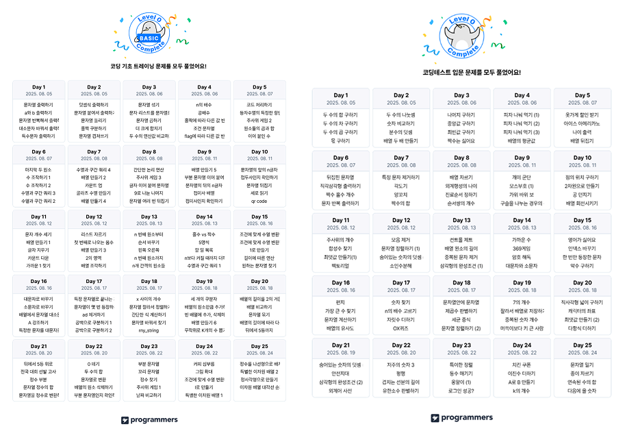

프론트엔드 코딩테스트 준비 겸 JS 기본기 익히기를 목표로 프로그래머스 기초 및 입문 트레이닝을 3주 동안 풀었다.  
기초와 입문 각 25일씩 `Lv.0` 문제를 풀어보는 과정이었는데, 전공자라 하루에 기초+입문 `2 Day`씩 달렸다.

초반에는 1시간 정도 걸렸고, 후반에는 2시간, 어려울 때는 3시간까지 문제 풀이에 시간을 들였다.

그동안 프론트엔드 구현에 `JavaScript`를 쓰긴 했지만 기초부터 체계적으로 배운 건 아니었다. 그래서 메서드 하나하나 알아가면서 풀었는데, 과정을 완료하는 시점에서 보니 각 메서드의 쓰임새를 익히고 문자열과 배열을 집중적으로 공략할 수 있어서 좋았다.

드디어 JS의 기초를 제대로 뗀 느낌 😊😅

`Lv.0`인데도 쉽지 않은 문제들이 섞여 있었지만, `JavaScript`에는 다른 언어에서 볼 수 없는 기특한 메서드가 참 많았다. 길게 풀어야 할 로직을 한 줄로 줄여주는 메서드들을 보며 확실히 `아는게 힘이다` 라는걸 느꼈다

`Lv.0`을 끝냈으니 이제 `Lv.1`을 차근차근 풀어볼 예정이다. 조금 풀어 보니까 `Lv.0`에서 기초를 탄탄히 다졌다면 `Lv.1`도 큰 어려움은 없을 것 같다! 

참고로 초반에는 기초와 입문 난이도가 비슷하지만, 입문 후반으로 갈수록 어려워진다. 기초와 입문을 따로 진행할 생각이라면 기초 → 입문 순서로 공부하는 것을 추천한다.

