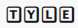
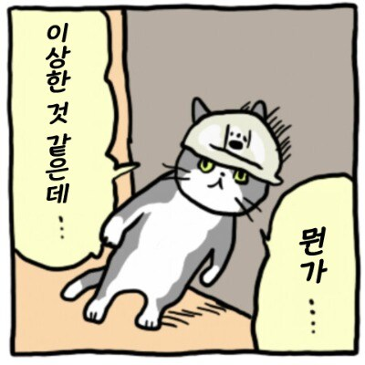

*최신 트렌드인 Next.js를 학습하고 적용했던 적용기입니다.*

블로그를 만들며 `Next.js`를 맛본 뒤, **이거 물건이다**라는 생각이 들었다.

배포도 빠르고 리액트랑도 비슷해서, 바로 다음 프로젝트 프레임워크로 선택했다.

그렇게 2명이서 야심차게 시작한 타자 연습 사이트 사이드 프로젝트 
[TYLE](https://tyletype.vercel.app)

처음엔 모든 게 순조로웠다.

`Vercel`에서의 배포는 순식간이었고, 리액트 했던대로 구현도 빠르게 했다.

하지만 프로젝트가 진행될수록 뭔가 이상함을 느꼈다.

**1. 이거 `use Client` 이렇게 많이 쓰면 안될 것 같은데**

`Next.js`가 SSR(서버 사이드 렌더링)에 강점이 있음에도 사이트 초기 메인화면 렌더링 속도가 너무 길었다.  
(거의 5초 이상?)

타자 연습 특성상 실시간 키보드 이벤트와 상태 업데이트가 70% 이상이었기 때문에  
화면에 거의 모든 곳에 `use client`가 필요했고, .

**2. SEO 쓸데가 없네**

검색 엔진 최적화가 장점이라지만, 타자 연습 사이트엔 텍스트 콘텐츠가 없기 때문에

키보드와 글귀만 있는 서비스에서 장점을 발휘 할 수가 없었다.

**3. 한글 입력과 렌더링**

특히 한글 입력이 자+모음이 합쳐지는 형태라 상태 업데이트가 특수한데,

( 조합 중인 글자가 상태와 동기화되면서 불필요한 렌더링을 유발한다는 점입니다.)

불필요한 렌더링과 엔터 키 중복 이벤트 이슈 등 클라이언트 최적화에 집중해야 하기 때문에

핵심인 타이핑 로직은 서버가 도와줄 수 없기 때문에 실제 성능의 핵심은 클라이언트 최적화에있었다.

오히려 아키텍처만 복잡해지고 있었다.

깨달음 : 기술은 도구일 뿐이다.

고려 없는 기술 도입은 오히려 아키텍처를 복잡하게 만들고

머리가 아파질 수 있다@.!

다음 프로젝트에서는 SEO와 초기 로딩 속도가 중요했기에 Next.js를 선택했지만

타자 연습 같은 프로젝트라면 가벼운 환경이 더 적합했을 것 같다.