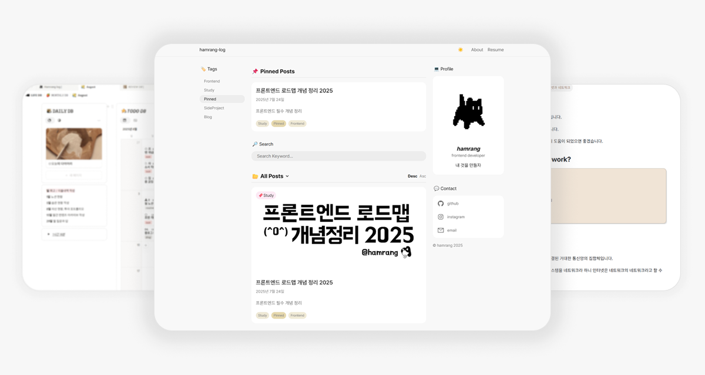
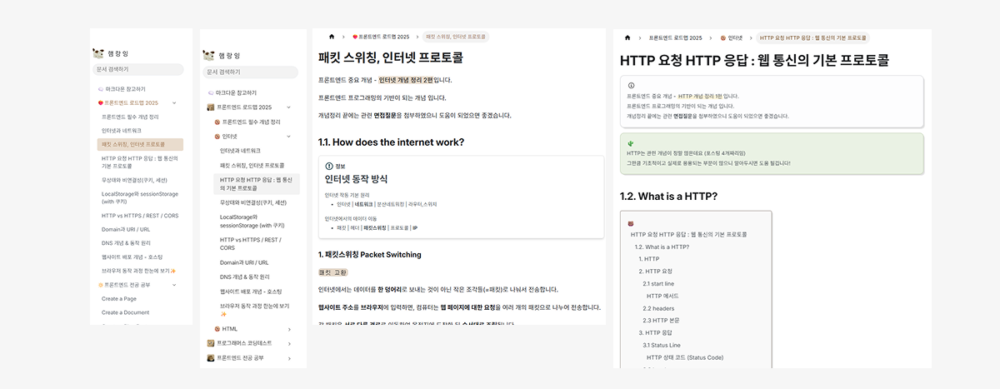

*블로그 N차 리모델링 기록*

티스토리, 네이버 블로그, 깃허브 커스텀 블로그, 노션 블로그를 떠도는 유목민 생활을 하다가 드디어 정착했다😊

티스토리 블로그 할때도 티스토리 특유의 HTML, CSS를 박으면서 공부했는데 노션 기반 블로그도 깃허브 블로그 여러 커스텀 테마들도 내가 100% 만족할만한 결과물이 나오지 않았다.



사진 중간에 있는 블로그는 바로 이전 블로그인 노션 기반 블로그인데, 오픈소스 [morethanlog](https://github.com/morethanmin/morethan-log)를 커스텀한 테마이다.

블로그 테마는 정말 마음에 들었지만, 노션 연동 특성상 업데이트가 너무 느려서 다시 깃허브 블로그로 회귀했다..

## Docusaurus를 고른 이유

어떤 테마를 기본으로 블로그를 만들어나갈까 하다, 기준을 정해서 선택하기로 하였다.

- 마크다운으로 글 쓰기
- GitHub Pages 배포
- 커스텀이 자유로울 것

`Docusaurus`는 이 세 가지를 딱 만족했고, 여러 참고할만한 자료들도 많이 있었다!


## 뜯어고치기 시작

내 취향에 맞게 단장했다. 사이드바 구조를 바꾸고, 메인 페이지도 새로 그리고, 포스팅 레이아웃도 좀 손봤다.

*Docusaurus는 [스위즐링](https://docusaurus.io/ko/docs/swizzling) 방법으로 컴포넌트를 추출하여 내부 컴포넌트를 수정할 수 있다.*



```bash
npx docusaurus swizzle @docusaurus/theme-classic BlogListPage
```

이렇게 꺼내서 내가 원하는 대로 바꾸면 된다.


굿~

---

> 다음 글 : [블로그 새단장!](/blog/blog-new-day)