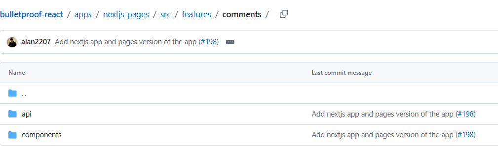
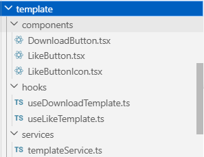

여러 프로젝트를 지나오면서 폴더 구조에 정답이 있는지 궁금했다.  
어떤 방식이 가장 효율적인지, 현업에서는 어떻게 쓰는지 알고 싶었지만 참고할 레퍼런스를 찾기가 쉽지 않았다.  
예전에 했던 개인 프로젝트에서는 역할 분리라는 목적으로 세분화된 폴더 구조를 적용해본 적이 있는데, 작은 프로젝트에서는 어울리지 않는다는 느낌을 받았다.  
그런데 이번에 코드 리팩토링을 하면서 `hook`과 `service`, `ui`를 분리했을때 얻는 유지보수성의 이점이 훨씬 크다는 것을 깨달았다. 

이제는 `Gemini`와 함께 현업에서 어떤 구조가 많이 쓰이는지, **폴더 구조의 정답이 있는지** 알 수 있게 되었다. `Gemini`는 어디서 폴더 구조를 참고하였는지 탐구해보자.

## 폴더 구조의 교과서

[Bulletproof-React](https://github.com/alan2207/bulletproof-react)  
`Gemini`가 말하는 **폴더 구조의 교과서**로 통하는 레포지토리이다. 이 프로젝트의 핵심은 기능 기반 구조에 있다.

`A simple, scalable, and powerful architecture for building production ready React applications.`

`components`, `hook` 폴더에 모든 파일을 넣는 것이 아니라, `src/features/comments`와 같이 특정 기능 단위로 폴더를 구성한다. 해당 기능에서만 사용하는 로직과 컴포넌트를 한 폴더에서 관리하는 방식이다.

## FSD(Feature-Sliced Design)

FSD는 여기서 더 나아가 **계층화**를 통해 엄격하게 의존성을 관리할 것을 제안한다. 가장 큰 특징은 **단방향 의존성**으로, 하위 계층이 상위 계층을 절대 참조할 수 없게 설계하여 코드 간 순서를 명확히 정의한다.

- **App**: 앱의 진입점 (Provider, 전역 스타일)
- **Processes**: 여러 단계가 필요한 비즈니스 로직
- **Pages**: 실제 화면 단위
- **Widgets**: 독립적인 큰 단위 (Header, Sidebar)
- **Features**: 사용자 행동 (좋아요 버튼, 검색 창)
- **Entities**: 비즈니스 (User, Product, Post)
- **Shared**: 공통 UI 컴포넌트, 유틸 함수

## 적용해보기

리팩토링을 하면서 이러한 폴더 구조를 따라가보고 있다. 기존에는  `component` 폴더와 `features `폴더에 로직이 몰려있었고, 이를 각각 `features` 폴더 내부로 분산시켰다.

- `src/features/template/hooks/useDownloadTemplate.ts`
- `src/features/template/service/tempolateService.ts`

기능을 새로 개발할때 `features` 폴더 안에 새로운 폴더를 만들기만 하면 된다는 포인트가 중요한 것 같다. 기능을 삭제하거나, 관련 함수를 테스트할때 폴더 하나만 확인하면 된다는 것이 작업에 매우 효율적이고 편리하다.

## Hook 과 API를 분리하자

작은 프로젝트에 이런 엄격한 구조를 도입하는 것이 번거롭게 느껴질 수 있다. 하지만 직접 적용하며 느낀 점은 **규모와 상관없이 관심사를 분리하는 습관이 필수적이다**는 점이다.

컴포넌트에서 직접 `API`를 호출하는 대신, `service`로 통신을 분리하고 이를 커스텀 `hook`으로 감싸는 구조를 추천한다. 이렇게 하면 나중에 `TanStack Query`를 도입하거나 낙관적 업데이트 로직을 추가할 때, `UI` 코드는 단 한 줄도 건드리지 않고 로직만 깔끔하게 교체할 수 있다.

## 마무리

그럼에도 완벽한 폴더 구조란 건 없다.  
기술은 변화하고, 그런 기술에 맞는 새로운 구조가 등장할 수 있다.  
그럼으로 유지보수하기 좋은 구조에 대한 고민을 계속 해가며 학습해나가야겠다.