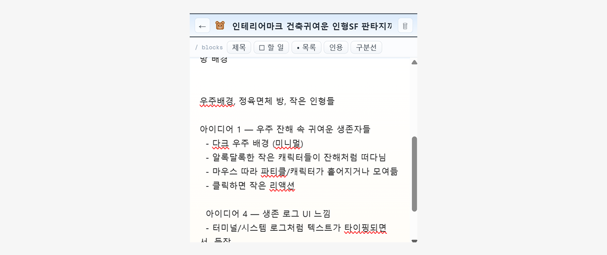
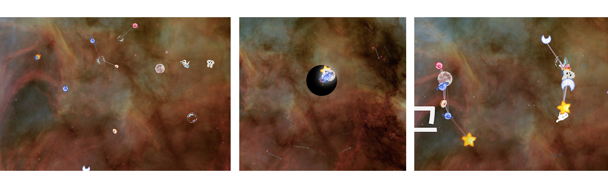
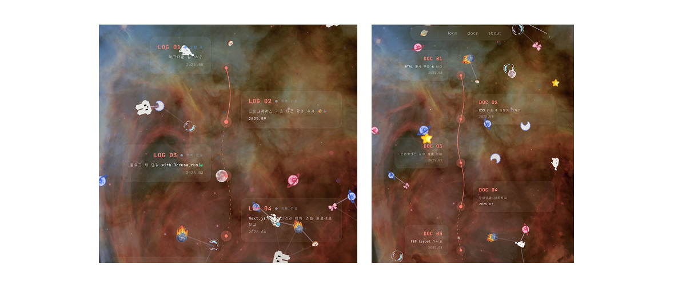

디자인의 세계는 어렵다. 그중 나한테 가장 어려운 부분은 **요소를 넣는 것**이다.  
*물론 깔끔하게 만드는 것도 엄청나게 어렵다*

심플, 모던 디자인은 참고할 만한 레퍼런스도 많았고, 다른 사람들도 편하게 볼 수 있어야 한다는 생각이 있어서 내 취향을 담는 게 꺼려졌다.

그런데 내가 가꾼 서비스 [띵타운](https://ddingtown.vercel.app)을 운영하면서 자신감이 좀 생겼다

<mark>블로그를 온전히 내 취향으로 꾸며보고 싶다!</mark>

## 테마를 찾아서

AI가 등장한 이후, 원하는 화면을 만들기가 훨씬 쉬워졌다. 문제는 내가 원하는 게 뭔지 몰랐다는 것이다.

**우주**라는 대략적인 테마를 잡고, 세부 컨셉을 찾기 시작했다.

- 계기판 — SF 느낌은 좋았는데 너무 복잡했다
- 우주선 내부 — 재밌긴 한데 가독성이 걱정됐다
- 티켓 / 탑승권 — 귀엽지만 블로그랑 어울리지 않았다
- 터미널 — 개발자스럽긴 한데 이미 흔한 컨셉이었다

그러다 두 가지 아이디어로 좁혀졌다.

## 배경이 반이다

마음에 드는 배경을 찾다가 [NASA 이미지](https://unsplash.com/ko/%EC%82%AC%EC%A7%84/%ED%95%98%EB%8A%98%EC%97%90-%EB%96%A0-%EC%9E%88%EB%8A%94-%EB%A7%A4%EC%9A%B0-%ED%81%B0-%EB%B3%84%EC%9D%98-%EC%9D%B4%EB%AF%B8%EC%A7%80-GVFWR7TBv7U)를 발견했다.

배경이 결정되니 어떻게 구상해야할지 느낌이 왔다.

## 구현한 것들

배경 위에 생동감을 더하기 위한 요소들을 추가했다

- **픽셀 이미지**: 우주를 천천히 떠다니는 별들을 추가했다
- **별자리**: 가까운 별들을 선으로 잇는 별자리 효과를 추가했다
- **블랙홀**: 클릭~꾹 누르면 블랙홀이 생겨나는 효과를 넣었다. 마우스를 떼면 모였던 이미지들이 퍼진다.

여기에 요즘 유행하는 글래스모피즘을 카드 UI에 적용해서 우주 배경과 잘 어우러지게 만들었다.
## 포스트 목록 화면

블로그 포스트 목록 페이지도 우주 테마에 맞게 바꿨다. 각 포스트가 **우주선 항로**처럼 이어지는 형태로 배치했다.

평범한 리스트 형태가 아니라, 우주선이 지나간 항로로 포스트들이 이어진 느낌이 마음에 든다.

## 마무리

원하는 걸 AI와 함께 빠르게 구현할 수 있게 되면서, 내가 원하는게 뭔지도 바로 알 수 있게 되었다.

계획했던 것보다 훨씬 더 만족스러운 결과가 나왔고, 

앞으로도 이 블로그를 이런 식으로 계속 다듬어 나갈 것 같다!
