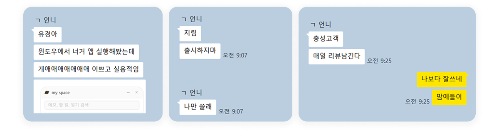

시간 관리를 위해 오래전부터 실물 플래너를 써왔다. 실물 플래너와 똑같은 기능의 데스크탑 앱이 없어서 노션을 써왔는데, 항상 옆에 띄우고 보는 용도로는 아쉬운 점이 있었다.

토스 블로그에서 한 디자이너분의 [투두 위젯 개발기](https://toss.tech/article/todolist)를 봤다. 이걸 보고 나서 나도 **내가 원하는 형태로 직접 만들어보자**는 생각이 들었다.

~ 자급자족 투두 위젯 겸 일기장 겸 플래너 겸 메모장 만들기 ~

`thanks to Claude ❤️ ` 

## 어떤 앱인가

앱 이름은 **Mars**. 데스크탑 위젯 형태의 `Electron` 앱이다.


탭은 총 여섯 가지다. 홈 / 메모 / 할 일 / 플래너 / 일기.  
실물 플래너에서 항상 쓰던 요소들을 그대로 옮겨왔다.


### 1. 홈

첫 탭은 월간 캘린더 뷰다. 활동을 한 날에는 그날 가장 오래 한 활동(in 플래너)의 색의 점이 찍힌다.

날짜를 누르면 그 날 하루의 기록이 보인다.  
- 활동 별 시간
- 남긴 메모
- 할 일과 완료 여부
- 일기

### 2. 메모

메모탭은 단순하게 상단 입력창에 적고 저장하면 시간순으로 쌓인다.

각 메모를 할 일로 넘기거나, 고정하거나, 삭제할 수 잇다.

### 3. 할 일

할 일은 세 구역으로 나뉜다.

- overdue. 지난 날에 못한 일
- today. 오늘 할 일
- later. 내일 할 일

각 항목은 수정하거나 순서를 바꿀 수 있고, 하위 항목을 생성할 수 있다.


### 4. 10분 타임 블록 플래너

하루를 10분 단위로 나눠서 활동을 드래그로 색칠하는 타임 블록 플래너.  
내 루틴에 맞게 기본값으로 미리 채워놨고, 실제 한 활동은 팔레트에서 골라 채우면 된다.  
각 활동에 몇 시간을 썼는지 통계로도 볼 수 있다.  
각 시간 옆에는 한 줄 메모를 남길 수 있다.

### 5. 일기와 기분 기록

일기 탭에서는 날짜별로 짧게 글을 남기고, 그날의 **기분**도 네 단계 이모지 중 하나로 기록한다.  
그날 완료한 할 일 목록, 활동시간, 메모가 일기 위에 있어서 보면서 하루를 돌아보기 좋다.

## 후기

솔직히 `Electron`이란 것도 처음 들어봤다. 기술 선택부터 코드 짜는 것까지 `Claude`의 도움을 받았는데, 기능 자체가 단순한 덕분에 하루 만에 완성할 수 있었다.

만들고 나서 실제로 매일 잘 쓰고 있다. 직접 만든 도구라 불편한 게 보이면 바로 고칠 수 있다는 게 너~무 좋다 ^^

언니가 써보고 싶다고 해서 설치파일도 줬고, 피드백도 받아볼 예정이다. 일단은 할 일 목록 옮기기, 월별 활동 통계 기능도 넣어볼 계획중이다.


## 후기 2

첫 베타테스터 언니 고마웡!!

```
그리고 쏟아지는 언니의 요청😱
- [] 어제 한 일 수정 기능
- [✔️] 하위 항목
- [✔️] 할 일 내용 수정
- [✔️] 플래너 항목 수정
- [✔️] 미래 할 일 저장

```


