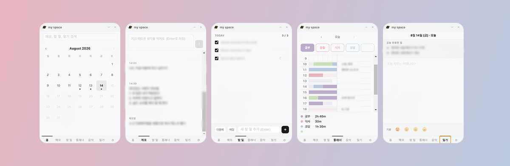

시간 관리를 위해 오래전부터 실물 플래너를 써왔다. 실물 플래너와 똑같은 기능의 데스크탑 앱이 없어서 노션을 써왔는데, 항상 옆에 띄우고 보는 용도로는 아쉬운 점이 있었다.

토스 블로그에서 한 디자이너분의 [투두 위젯 개발기](https://toss.tech/article/todolist)를 봤다. 이걸 보고 나서 나도 **내가 원하는 형태로 직접 만들어보자**는 생각이 들었다.

~ 자급자족 투두 위젯 겸 일기장 겸 플래너 겸 메모장 만들기 ~

`thanks to Claude ❤️ ` 

## 어떤 앱인가

앱 이름은 **Mars**. 데스크탑 위젯 형태의 `Electron` 앱이다.

탭은 총 여섯 가지다. 홈 / 메모 / 할 일 / 플래너 / 음악 / 일기.  
실물 플래너에서 항상 쓰던 요소들을 그대로 옮겨왔다.

### 10분 타임 블록 플래너

하루를 10분 단위로 나눠서 활동을 드래그로 색칠하는 타임 블록 플래너.  
내 루틴에 맞게 기본값으로 미리 채워놨고, 실제 한 활동은 팔레트에서 골라 채우면 된다.  
각 활동에 몇 시간을 썼는지 통계로도 볼 수 있다.  
플래너 옆에는 할 일을 메모 할 수 있다.  

### 일기와 기분 기록

일기 탭에서는 날짜별로 짧게 글을 남기고, 그날의 **기분**도 네 단계 이모지 중 하나로 기록한다.  
그날 완료한 할 일 목록, 활동시간, 메모가 일기 위에 있어서 보면서 하루를 돌아보기 좋다.

## 후기

솔직히 `Electron`이란 것도 처음 들어봤다. 기술 선택부터 코드 짜는 것까지 `Claude`의 도움을 받았는데, 기능 자체가 단순한 덕분에 하루 만에 완성할 수 있었다.

만들고 나서 실제로 매일 잘 쓰고 있다. 직접 만든 도구라 불편한 게 보이면 바로 고칠 수 있다는 게 너~무 좋다 ^^

언니가 써보고 싶다고 해서 설치파일도 줬고, 피드백도 받아볼 예정이다. 일단은 할 일 목록 옮기기, 월별 활동 통계 기능도 넣어볼 계획중이다.
