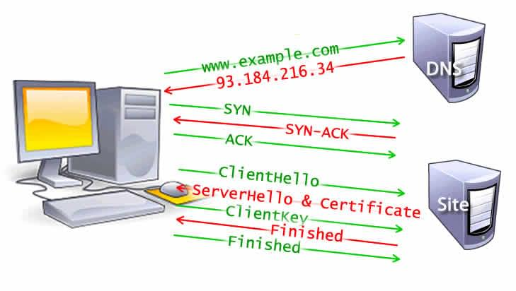
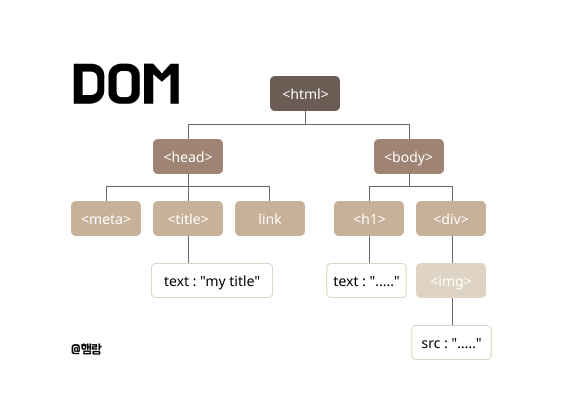

# 브라우저 동작 과정 한눈에 보기✨

:::note
프론트엔드 중요 개념 - <mark>브라우저 개념 정리</mark>입니다.

프론트엔드 프로그래밍의 기반이 되는 개념 입니다.

개념정리 끝에는 관련 **면접질문**을 첨부하였으니 도움이 되었으면 좋겠습니다.
:::
:::warning
길었던 인터넷 개념 정리 마지막 포스팅이다~

지난 개념 (HTTP, 도메인, DNS 등) 모든 개념이 총집합합니다.

그냥 한번 쭉 읽어보세요~~(걍 레전드로 길고 복잡하다.. )
:::

## 1.6. Browsers and how they work?
:::info
- [브라우저 동작 과정 한눈에 보기✨](#브라우저-동작-과정-한눈에-보기)
  - [1.6. Browsers and how they work?](#16browsers-and-how-they-work)
    - [배경 지식](#배경-지식)
      - [📌지연시간](#지연시간)
      - [📌싱글쓰레드](#싱글쓰레드)
      - [성능 향상 방법](#성능-향상-방법)
    - [이전 내용](#이전-내용)
      - [웹 페이지 탐색 과정](#웹-페이지-탐색-과정)
      - [웹 페이지 탐색 과정 최적화](#웹-페이지-탐색-과정-최적화)
    - [새로운 내용](#새로운-내용)
      - [브라우저의 렌더링 과정 (웹 페이지 탐색 이후)](#브라우저의-렌더링-과정-웹-페이지-탐색-이후)

:::

 

### 배경 지식

프론트엔드 개발자라면 브라우저가 어떻게 동작하는지 이해하는 것이 중요합니다. 그 이유는 더 **빠르고**, **상호작용이 원활한** 웹 사이트를 제공해야 하기 때문입니다. 
콘텐츠가 로딩하는 데 오랜 시간이 걸리면, 사용자는 웹 페이지를 떠나버립니다. 이를 개선하기 위해 **로딩이 빠르고**, 스크롤이나 클릭 같은 **상호작용**이 자연스럽게 이루어지는 웹 환경을 만들어야 합니다.

---
<mark>**웹 성능의 두가지 요점**</mark>

📌 지연시간  
📌 싱글쓰레드
 

#### 📌지연시간

지연시간은 사용자의 요청에 대해 **브라우저가 콘텐츠를 보여줄 때 까지 걸리는 시간**을 의미합니다. 웹에서의 지연시간은 주로 네트워크 속도, 요청 수, 리소스 용량에 의해 영향을 받습니다. 빠르게 로딩되는 웹사이트를 개발하기 위해서는 최대한 빠르게 요청을 시작하고, 최소한의 리소스만 효율적으로 불러오는 전략이 필요합니다. 
 

#### 📌싱글쓰레드

대부분의 브라우저는 **메인 쓰레드**가 하나뿐입니다. 그리고 아래의 작업을 동시에 처리합니다. 처리가 더뎌진다면 전체 렌더링이 느려지고, 사용자 입장에서는 스크롤이 끊기거나 반응 속도가 느려질 수 있습니다. 

- HTML 파싱
- 스타일 계산
- 레이아웃, 페인팅, 렌더링
- JavaScript 실행
- 사용자 입력 처리(스크롤, 터치)

 

#### 성능 향상 방법

성능 향상을 위하여 프론트엔드 개발자가 할 수 있는 방법은 다음과 같습니다.

1. 렌더링 최적화   
   `애니메이션 최적화(reflow, repaint 최적화)`
    - DOM 변경 최소화, reflow/repaint 줄이기
    - GPU 활용을 고려한 애니메이션 사용
    - Web Worker 활용
    - JS 최적화, 이벤트 최소화
    - 메인 쓰레드 작업 시간 줄이기
2. 로딩 최적화  
    `페이지가 처음 뜨기까지 얼마나 빨리 필요한 리소스를 불러오는지`
    - HTML 문서 크기 최소화
    - CSS/JS 파일 압축, 병합
    - 비동기 처리 활용 (`async`, `defer`, `requestIdleCallback` 등)
    - HTTP 요청 수 줄이기

---

### 이전 내용

다음은 앞선 포스팅에서 설명했던 과정 + 자세한 내용입니다.

 

#### 웹 페이지 탐색 과정

사용자가 주소창에 URL을 입력하거나, 폼을 제출하는 등을 통해 새 페이지 요청을 보낼때마다 웹 페이지 탐색이 일어납니다.

1. **DNS 조회 (DNS Lookup)**
    
    도메인 이름을 IP 주소로 변환하는 과정  
    해당 도메인을 처음 방문하거나 캐시에 없다면 DNS 조회 필요
    
2. **TCP 핸드셰이크 (TCP 3-Way Handshake)**
    
    ‘핸드셰이크🤝’라는 단어 그대로, 서버와 클라이언트가 연결할 준비가 되었는지 확인(🤝악수)하는 과정입니다. 통신 가능한 상태인지 확인하기 위해서 **3단계의 메시지 교환 흐름**이 발생합니다.  

    `SYN → SYN-ACK → ACK` (3개의 메시지 교환)  
    `SYN` 클라이언트 → 서버 : 연결요청(`SYN`)  
    `SYN-ACK` 서버 → 클라이언트 : 요청에 대한 응답(`ACK`) + 연결요청(`SYN`)   
    `ACK` 클라이언트 → 서버 : SYN-ACK에 대한 응답(`ACK`)  
    
    

    
TCP 혼잡 제어 & TCP 슬로우 스타트

        
        네트워크는 불안정할 때가 있기 때문에, TCP는 데이터 전송량을 조절합니다.
        
        **TCP 슬로우 스타트**
        
        초기에는 데이터를 적게 보내고, 서버가 ACK 응답을 통해 데이터가 잘 받고 있다고 확인되면
        
        CWND(혼잡 윈도우 - 전송 가능한 세그먼트 수) 값을 두 배로 증가합니다.
        
        네트워크가 혼잡하거나 손실이 생겨 ACK 응답을 받지 못했을 경우 CWND를 절반으로 감소시켜 속도와 안정성을 챙깁니다.
    

3. **TLS 협상 (TLS Negotiation)**
    
    HTTPS 사이트 접속시 이루어지는 과정입니다. (필수 보안 조치)
    
    - 서버의 신원 확인
    - 암호화 방식 협의
    - 안전한 통신을 위한 키 교환
    
    위의 과정을 협의하기 위해서 **🤝5단계의 메시지 교환 흐름**이 발생합니다.  

    `ClientHello` 클라이언트 → 서버 : 암호화 알고리즘 목록, 랜덤 데이터, TLS 버전 등 전송  
    `ServerHello` 서버 → 클라이언트 : 알고리즘 선택, **서버의 디지털 인증서**, 서버의 랜덤 데이터 등 전송  
    클라이언트 : 서버의 인증서 확인  
    `키 교환` 클라이언트 → 서버 : 양쪽이 공통된 **세션 키(대칭 키)** 생성  
    `Finished` 클라이언트 → 서버 : 세션키로 암호화된 Finished 전송  
    `Finished` 서버 → 클라이언트 : 세션키로 암호화된 Finished 전송  

1. **HTTP 요청 및 응답**
    
    연결이 성립되면 브라우저는 유저 대신 **초기 HTTP 요청**을 보냅니다.
    
    - 보통 첫 요청은 HTML 문서
    - 서버는 요청에 대해 **HTTP 응답 헤더 + HTML 본문** 전달
    
    
    TTFB (Time To First Byte) : 클라이언트가 요청을 보내고 첫 번째 바이트를 받을 때까지의 시간
    
---

#### 웹 페이지 탐색 과정 최적화

웹 페이지 탐색 과정에서 여러 차례 왕복통신(RTT)을 수행하기 때문에 통신 지연을 최적화 하는 것 또한 중요한 일입니다.

최적화 전략

- DNS 프리페치
- Keep-Alive 연결 유지
- HTTP/2 사용
- TLS 1.3 도입 등

---

### 새로운 내용

#### 브라우저의 렌더링 과정 (웹 페이지 탐색 이후)

이전 내용에서는 브라우저가 **요청을 전송**하고 서버로부터 **응답**을 받는 **탐색 과정**을 살펴봤습니다.

새로운 내용은 서버로부터 HTML 문서를 받아오면, **브라우저가 어떻게 화면에 띄우는지**에 대한 내용입니다.

1. **HTML 파싱 → DOM 구축**
    
    서버로부터 받은 HTML은 단순한 문자열이기 때문에 브라우저는 HTML을 한 글자씩 읽어 DOM을 구성합니다.
    
    - `html>`, `<body>`, `
`, `
` 같은 **태그**
    - 태그에 딸린 **속성들**
    - 안에 들어있는 **텍스트 노드**
    
    
    
2. **프리로드 스캐너**
    
    브라우저는 HTML 파싱을 하면서 동시에, 프리로드 스캐너도 돌립니다.
    
    프리로드 스캐너는 렌더링에 필요한 **외부 리소스**를 미리 찾아서 **병렬로 요청**합니다.
    
    `<script src="">`, `<link>`, ``, `` 등 
    
    덕분에 리소스가 실제로 필요한 시점엔 이미 리소스가 다운로드 중이거나 받은 후 이기 때문에 렌더링 속도가 빨라집니다. 
    
    - 페이지 로딩속도 대폭향상
    
3. **CSS 파싱 → CSSOM 구축**
    
    `<style>` 태그나 외부 CSS 파일을 파싱해서 CSSOM을 구성합니다.
    
4. **렌더 트리 (Render Tree) 생성**
    
    브라우저는 DOM과 CSSOM을 결합하여 Render Tree를 구성합니다.
    
    - 이때 실제 화면에 보여질 요소들만 포함 (예 `display :none`은 포함되지 않음)
    
5. **레이아웃 단계 (Layout / Reflow)**
    
    화면의 어디에 어떤 요소를 그릴지 계산하는 과정입니다.
    
    - 각 요소의 위치
    - 요소의 너비, 높이, 마진, 패딩 등
    
6. **페인팅 (Painting)**
    
    레이아웃 구성이 끝나면 화면에 그립니다.
    
    렌더 트리의 요소들이 픽셀로 전환되어 브라우저에 그려집니다.
    
    - 글자 색, 폰트, 테두리, 배경, 그림자
    
7. **컴포지팅(Compositing)**
    
    fixed 요소, CSS transform이 적용된 요소, 영상 등은 다른 레이어로 분리되는데,
    
    브라우저는 여러 레이어로 나뉘어진 요소들을 **합성(Composite)** 해서 최종 화면을 그립니다.
    

 

:::warning

**웹사이트 접속 과정 요약**
1. DNS 쿼리 : 도메인 이름을 통해 IP 주소를 찾기 위해 DNS 쿼리 수행
2. TCP 핸드셰이크 : 브라우저가 해당 IP로 연결 수행
3. TLS 핸드셰이크 : (HTTP) 제 3자가 데이터를 읽을 수 없도록 암호화된 연결 수행
4. HTTP 요청 : 브라우저는 웹 페이지 로드를 위한 콘텐츠 요청
5. HTTP 응답 : 웹 서버에서 HTML, CSS, JS 코드 형식으로 콘텐츠 전송
6. 렌더링 : 브라우저에서는 HTML 문서를 렌더링하여 화면에 표시
   
**전체 렌더링 과정 요약**
1. HTML → DOM 
2. CSS → CSSOM
3. DOM + CSSOM → Render Tree
4. Render Tree → Layout → Paint → Composite → 화면출력
:::