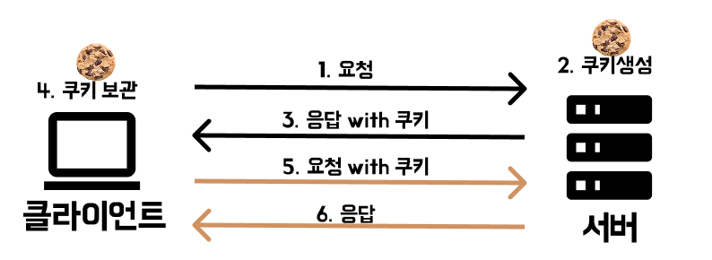
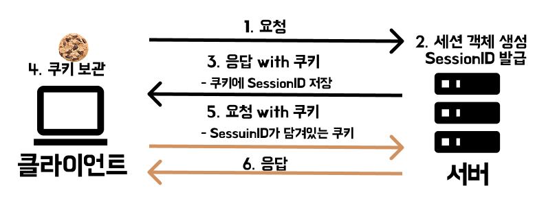

# 무상태와 비연결성(쿠키, 세션)

:::note
프론트엔드 중요 개념 - <mark>HTTP 개념 정리 2편</mark>입니다.

프론트엔드 프로그래밍의 기반이 되는 개념 입니다.

개념정리 끝에는 관련 **면접질문**을 첨부하였으니 도움이 되었으면 좋겠습니다.
:::

## HTTP 특징
### 비연결성 Connectionless

`(연결이 끊긴다.)`

HTTP는 클라이언트의 요청에 맞는 응답을 마치면 연결을 끊는 `비연결성`의 특징을 가집니다. 각 요청과 응답 간에 연결을 유지하지 않기 때문에 **서버 자원을 효율적으로 사용**할 수 있습니다. 하지만 매번 새로운 연결을 시도/해제하는 과정에서 연결/해제에 대한 오버헤드가 발생합니다.

- 연결을 유지하는 서버의 자원이 소모되지 않음
- 트래픽이 많고, 큰 규모의 서비스를 운영할 때 한계가 드러남
- 연결을 계속해서 새로 맺어야함

:::note
클라이언트A: 방을 예약하고 싶습니다.  
서버X: 네 가능합니다.
(응답후 바로 연결 끊김)

클라이언트A:  7월 23일로 예약하고 싶습니다.  
서버X: 7월 23일 예약 가능합니다. 
(응답후 바로 연결 끊김)

클라이언트A:  2명 예약할게요.  
서버X: 예약 완료되었습니다. 
(응답후 바로 연결 끊김)
:::

### 무상태 Stateless

`(상태가 없다.)` 

HTTP는 상태 정보를 저장하지 않는 `무상태`의 특징을 가집니다. 서버가 클라이언트의 상태를 보존하지 않기 때문에 동일한 연결상에서 전달된 **이전 요청**과 **다음요청**이 서로 관련성이 없습니다.


:::note
클라이언트A: 방을 예약하고 싶습니다.  
서버X: 어떤 날짜에 예약하시겠어요?  

클라이언트A:  방을 예약하고 싶습니다. 날짜는 7월 23일 입니다.  
서버Y: 인원은 어떻게 되시나요?  

클라이언트A: 방을 예약하고 싶습니다. 날짜는 7월 23일 입니다. 2인입니다.  
서버Z: 예약 완료되었습니다.
:::

위의 예시에서 서버는 이전요청을 기억하지 못하고 따라서 클라이언트A는 매번 새로 요청을 보내고 있습니다. 

장점
- 서버가 상태를 저장하지 않으므로 여러 서버에 **분산**해도 문제 없음
- 각각의 요청에 응답만 보내주면 완료
  
단점
- 매 요청마다 **데이터 중복**
- 클라이언트의 부담이 큼
- **연결된 동작에 부적합**


---


## 상태를 기억하는 방법

`쿠키, 세션`

HTTP는 본래 무상태(Stateless) 프로토콜이라 요청 간에 정보를 기억하지 못합니다. 하지만 현실에서는 **로그인 유지**나 **장바구니**처럼 사용자의 상태를 기억할 필요가 있습니다. 따라서 `쿠키, 세션, 토큰` 같은 방법을 통해 HTTP 위에서 상태 정보를 관리합니다.
<br/>

### 🍪 쿠키

쿠키는 `브라우저`에 저장되는 작은 데이터 파일입니다. 사용자가 따로 요청하지 않아도 브라우저가 요청 시에 `요청 헤더`를 넣어서 **자동으로 서버에 전송**합니다. 사용자 인증이 유효한 시간을 명시할 수 있으며, 브라우저가 종료시에도 인증이 유지됩니다.



1. 클라이언트가 서버에 요청을 보냄
2. 서버에서 쿠키를 생성
3. 서버는 응답 헤더 `Set-Cookie`에 쿠키를 포함해 응답
    ```jsx
    HTTP/1.1 200 OK
    Set-Cookie: user_id=abc123; Max-Age=3600; Path=/
    ```
4. 클라이언트가 쿠키 저장 
5. 이후 요청시 쿠키를 요청 헤더에 포함
    ```jsx
    // 요청 헤더 예시
    GET /index.html HTTP/1.1  
    Host: example.com  
    Cookie: user_id=abc123; theme=dark
    ```
6. 서버가 필요에 따라 쿠키를 변경하거나 삭제하여 응답

### 세션

세션은 **쿠키를 기반**으로 하며, **서버**에서 관리하는 데이터 파일입니다. 웹 브라우저가 서버에 접속한 시점부터 브라우저를 종료할때까지 인증상태를 유지합니다. 사용자에 대한 정보를 서버에 두기때문에 쿠키보다 보안에 좋지만 사용자가 많아지면 서버 메모리를 많이 차지합니다. 



1. 클라이언트가 서버에 요청을 보냄

2. 서버가 세션 객체 생성 + 쿠키 생성(SessionId)

3. 서버는 응답 헤더 `Set-Cookie`에 SessionID를 담아 응답

4. 클라이언트가 SessionID를 쿠키로 저장

5. 이후 요청시 SessionID가 담긴 쿠키를 요청 헤더에 포함

6. 서버는 SessionID를 이용해 세션 정보를 조회하여 처리


### 쿠키와 세션의 차이점 한눈에 보기

쿠키와 세션은 모두 클라이언트의 상태를 유지하기 위한 기술이지만, **저장위치**와 **방식**에서 차이가 있습니다.

쿠키는 서버가 응답할 때 생성되어 **브라우저**에 저장됩니다. 이후 요청마다 쿠키가 함께 전송됩니다. 만료 시간을 설정할 수 있고, 브라우저 종료시에도 유지됩니다.

세션은 **서버**에서 생성되고 관리됩니다. 클라이언트는 세션 ID만 쿠키 형태로 가지고 있으며, 서버는 **세션ID**를 통해 세션 정보를 식별합니다. 세션은 일반적으로 브라우저 종료시 삭제되며, 쿠키보다 보안성이 높지만 서버 자원을 더 사용합니다.

| **구분** | **쿠키 (Cookie)** | **세션 (Session)** |
| --- | --- | --- |
| **저장 위치** | 클라이언트(브라우저) | 서버 |
| **정보 저장 방식** | 키-값 형태로 직접 정보 저장 | 서버에 저장하고, 식별자(**`session id`**)만 클라이언트에 전달 |
| **식별 방식** | 클라이언트가 쿠키를 요청마다 자동 전송 | 클라이언트가 **`sessionid`**를 쿠키에 담아 전송 |
| **서버 부하** | 낮음 (정보 저장 안 함) | 높음 (모든 세션 정보를 서버에 저장) |
| **보안** | 비교적 취약 (변조 가능, XSS 주의) | 비교적 안전 (정보는 서버에 있음) |
| **만료 시점** | 쿠키 저장시 설정 `max-age expires` | 서버에서 세션 유효기간 설정 (브라우저 종료시 삭제) |
| **속도** | 빠름 | 느림 |

쿠키와 세션의 사용 예

| **상황** | **추천 방식** |
| --- | --- |
| 일반 웹 로그인 | 세션 + 쿠키 |
| 간단한 설정 저장(다크모드, 로그인유지) | 쿠키 |