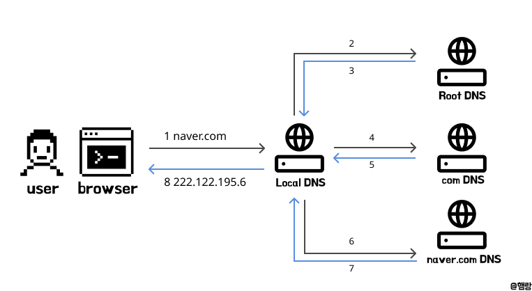

# DNS 개념 & 동작 원리

:::note
프론트엔드 중요 개념 - <mark>Domain 개념 정리 2편</mark>입니다.

프론트엔드 프로그래밍의 기반이 되는 개념 입니다.

개념정리 끝에는 관련 **면접질문**을 첨부하였으니 도움이 되었으면 좋겠습니다.
:::

## DNS(Domain Name System)란?

인터넷에서 웹사이트에 접속할 때 우리는 도메인 이름 `www.google.com`을 사용합니다. 하지만 컴퓨터는 실제로 IP주소 `142.250.207.14`를 사용해 통신합니다.

`DNS`는 사용자가 입력한 **도메인 이름**을 해당하는 **IP주소**로 변환하는 시스템이며, 반대로 IP주소를 도메인으로 바꾸는 역할도 수행합니다.

## naver.com을 입력하면 일어나는 일

DNS가 실제로 어떻게 작동하는지 알아보기 위해, 사용자가 브라우저에 도메인 이름 `naver.com`을 입력했을때 일어나는 일을 알아보도록 합시다.

1. 사용자가 웹 브라우저에 도메인 이름 `naver.com` 입력
2. 브라우저는 도메인 이름에 대한 IP 주소를 얻기 위해 **DNS 조회** 시작  
    (기본적으로는 `http://naver.com`로 요청)
3. DNS 서버에 접속하여 `naver.com`에 해당하는 **IP주소를 요청** 
4. DNS 서버는 도메인에 연결된 IP주소 `223.130.192.200`를 확인하고, 사용자에게 전달
5. 사용자 PC는 받은 IP 주소로 해당 페이지 정보에 대한 요청을 전송함 `HTTP 요청`
6. 웹 서버는 HTTP 요청 메세지를 받고 응답 데이터를 반환 `HTTP 응답`

여기서는 3번~4번 과정이 간략하게 설명되어있는데,  
어떻게 DNS가 도메인에 해당하는 IP정보를 찾을 수 있는지 자세히 살펴봅시다.

## DNS가 어떻게 IP주소를 찾을까?

전세계적으로 등록된 도메인 수는 2014년 기준 약 2억 7천만개입니다.

몇 억개의 도메인들을 일일히 탐색할 순 없으니 DNS는 **계층적 구조**를 통해 도메인을 단계적으로 탐색합니다.

가령 이 블로그 `eeheueklf.github.io`과 같은 도메인에 접속하려고 할때, 이 도메인에 해당하는 IP주소로 연결하기 위해 다음 단계를 거칩니다.

1. Local DNS 서버

    `eeheueklf.github.io`의 IP 주소가 **DNS 캐시**에 저장되어 있다면 → 바로 응답  
    없는 경우 →  Root DNS 서버에 재귀 질의 시작(2번으로)

2. Root(.) DNS 서버

    `.io`이라는 최상위 도메인(TLD)을 관리하는 DNS 서버 주소를 알려줌

3. .io TLD DNS 서버

    `github.io` 도메인을 관리하는 DNS 서버를 알려줌

4. github.io DNS 서버

    `eeheueklf.github.io`의 IP 주소를 알고 있다면 → 응답  
    없는 경우 → 하위 DNS 서버를 알려줄 수 있음

이처럼 DNS는 루트 서버부터 시작해 점점 구체적인 정보를 가진 서버를 탐색하며 원하는 도메인의 IP주소를 찾아냅니다.

### DNS 캐시란?

DNS 서버(특히 **Local DNS 서버**)는 자주 요청되는 도메인 정보를 효율적으로 처리하기 위해 최근에 조회한 IP 주소 결과를 **캐시에 저장**해둡니다.

누군가 `eeheueklf.github.io`에 접속했었다면 Local DNS는 그때 얻은 IP 주소를 일정 시간(TTL) 동안 캐시에 보관합니다.

#### **🕓** TTL(Time To Live)이란?

TTL은 DNS 정보가 캐시에 저장될 수 있는 유효시간(초 단위)을 나타냅니다. 이 시간이 지나면 해당 캐시 정보가 자동으로 삭제되고, 이후 접속시 다시 전체 DNS 탐색 과정이 이루어집니다.

`eeheueklf.github.io`의 TTL이 86400초(하루)라면 하루동안은 DNS 탐색 없이 캐시에 저장된 IP 주소를 바로 사용합니다. 이를 통해 네트워크 트래픽이 감소하고, 응답 속도를 향상시킬 수 있습니다.
 

  
도메인 관련 면접 질문

    
    @ DNS란 무엇이며, 어떻게 동작하나요?

