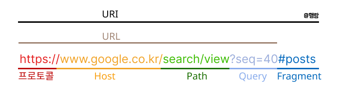

# Domain과 URI / URL

:::note
프론트엔드 중요 개념 - <mark>Domain 개념 정리 1편</mark>입니다.

프론트엔드 프로그래밍의 기반이 되는 개념 입니다.

개념정리 끝에는 관련 **면접질문**을 첨부하였으니 도움이 되었으면 좋겠습니다.
:::

## 도메인 이름이란?

인터넷에서 웹사이트를 찾을때 우리는 google.com이나 naver.com같은 인터넷 주소를 사용하는데, 이렇게 문자로 만든 주소가 도메인입니다. 실제 웹사이트 주소는 **IP주소**라고 불리는 숫자들의 조합으로 이루어져 있기 때문에 도메인을 통해 IP 주소를 찾는 매칭하는 과정도 필요합니다..

- 도메인 : 사람이 이해하고 기억하기 쉽게 만든 주소 `google.com`
- IP 주소 : 컴퓨터끼리 통신할 때 사용하는 **숫자로 된 실제 주소** `49.8.14.121`


## 도메인 구조에 대해 알아보자

`www` . `naver` `.com` `.`

도메인 주소는 단순히 naver.com으로 보이지만, n층의 계층적 구조로 되어있습니다.

```jsx
www / naver /.com /.
서브도메인 / 도메인 이름 / 최상위 도메인 / 루트도메인

루트도메인 → 최상위 도메인 (TLD) → 도메인 이름 → 서브도메인 
```

#### 루트도메인

`.`

우리가 입력하는 도메인 주소에는 보이지 않지만 실제로는 주소 마지막에 점(.)이 생략되어있다.

#### 최상위 도메인(TLD, Top Level Domain)

`.kr .jp .cn .net .com`

#### 2단계 도메인(SLD, Second-)

`.co.kr .go.kr .or.kr`

최상위 도메인 앞에 위치한 단계

google.co.kr  
- .kr = 최상위 도메인
- .co.kr = 2단계 도메인

google.com
- .com = 최상위 도메인
- google = 2단계 도메인

#### 도메인 이름(Domain Name)

`google naver`

#### 서브도메인

`www, blog, mail`

도메인을 세부적으로 나누기 위한 부가적인 요소

www.google.com / blog.naver.com / mail.google.com


---


## URI, URL, 도메인 쉽게 정리하기



#### URI

웹 상의 자원(Resource)를 식별하기 위한 고유한 문자열  
형식 제한은 없고, <mark>리소스를 식별 할 수 있다면 URI</mark>입니다.

`google.co.kr/search/view?seq=40`
`naver.com`

#### URL

URI 중에서 특히 <mark>**리소스 위치**</mark>를 가리키는 주소입니다.  
자원이 어디에 위치하는지(주소) + 어떻게 접근할지(프로토콜)로 구성됩니다.  
보통 `프로토콜://호스트:포트/경로?쿼리` 로 이루어져 있습니다.  

`https://google.co.kr` → 웹 페이지 주소  
`ftp://example.com/file.txt` → 파일 서버 주소

#### 도메인

URI나 URL의 host 부분에 들어가는 값으로 IP주소 대신 사람이 이해하기 쉽게 만든 주소입니다.

- `https://google.co.kr`에서 도메인: `google.co.kr`

:::warning
- **URI**: 자원을 식별하는 고유 문자열 (모든 주소의 상위 개념)
- **URL**: 자원의 위치와 접근 방법까지 알려주는 URI의 하위 개념
- **도메인**: URL/URI의 host 부분에 IP 대신 들어가는 사람이 기억하기 쉬운 이름
:::
<br/>
<details>
  <summary>도메인 관련 면접 질문</summary>
    
    @ www.google.com 도메인을 브라우저에 입력했을 때 일어나는 일을 순차적으로 설명해주세요.
    
    @ URI와 URL의 차이점은 무엇인가요
</details>

