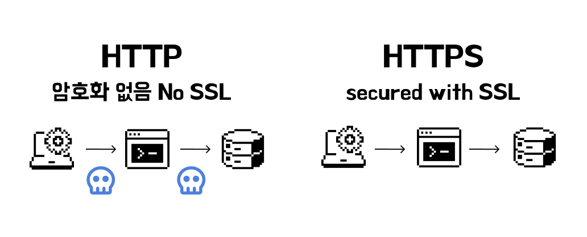
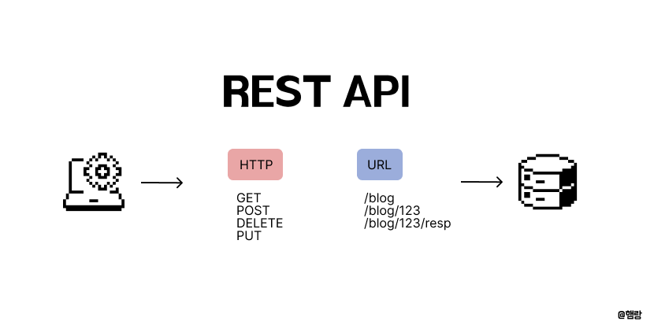
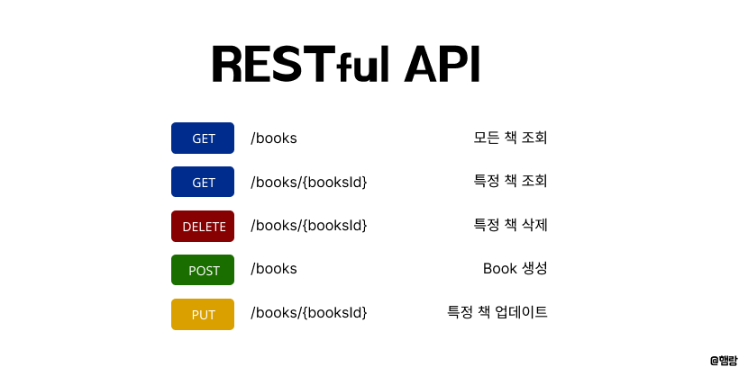

# HTTP vs HTTPS / REST / CORS

:::note
프론트엔드 중요 개념 - <mark>HTTP 개념 정리 4편</mark>입니다.

프론트엔드 프로그래밍의 기반이 되는 개념 입니다.

개념정리 끝에는 관련 **면접질문**을 첨부하였으니 도움이 되었으면 좋겠습니다.
:::

## 1.2. What is a HTTP?

:::info
- [HTTP vs HTTPS / REST / CORS](#http-vs-https--rest--cors)
  - [1.2. What is a HTTP?](#12-what-is-a-http)
  - [HTTP와 HTTPS의 차이점이 무엇인가요](#http와-https의-차이점이-무엇인가요)
  - [REST / REST API / RESTful API란 무엇인가요](#rest--rest-api--restful-api란-무엇인가요)
  - [CORS에 대해서 설명해주세요.](#cors에-대해서-설명해주세요)

:::

## HTTP와 HTTPS의 차이점이 무엇인가요



 HTTP(Hypertext Transfer Protocol)는 웹에서 데이터를 주고 받기 위한 서버-클라이언트(브라우저)의 프로토콜입니다. HTTPS(Hypertext Transfer Protocol `Secure`)는 HTTP에 **데이터 암호화가 추가된 프로토콜**입니다. (데이터를 안전하게 전송하기 위해 SSL 또는 TLS 프로토콜을 사용합니다. )

 HTTP와 HTTPS의 가장 큰 차이점은 **보안성**입니다. HTTP는 **평문으로 데이터를 전송**하기때문에 중간 공격자가 데이터를 가로챌 경우, 내용을 쉽게 확인할 수 있습니다. 반면에 HTTPS는 **데이터를 암호화하여 전송**하기 때문에 중간 공격자가 데이터를 읽거나 수정하는 것을 방지합니다.

 또한 HTTPS는 **검증된 사이트**만 허가받을 수 있기 때문에 서버가 제공하는 인증서를 통해 접속한 웹사이트가 신뢰할 수 있는 곳인지 확인할 수 있습니다. 

[자세한 HTTPS 동작 과정 - 브라우저 동작 과정 한눈에 보기✨](https://eeheueklf.github.io/docs/fe-study/browser/)


---


## REST / REST API / RESTful API란 무엇인가요

`Representational Station Transfer`

**API란?** 

API는 서로 다른 소프트웨어끼리 대화할 수 있게 해주는 통신 방법입니다.

우리가 개발할때는 프론트에서 백엔드로 API 요청을 보내고, 백엔드는 그 요청을 받아 프론트에서 전달한 데이터를 처리합니다.
<br/>

**REST란?**

REST란 `주소와 메서드`만으로도 어떤 작업인지 추론할 수 있도록 하는 지침입니다. 즉, 요청된 주소만 보고도 어떤 자원(Resource)에 관한 요청인지 알 수 있도록 설계하는 것 입니다.
<br/>

**REST API란?**

REST한 설계를 따르는 API



- `GET` `/posts`는 게시글 가져오기
- `POST` `/posts`는 게시글 생성
- `DELETE` `/posts/1`는 1번 게시글 삭제

`URI`는 자원, `HTTP 메서드(POST,GET,PUT,PATCH,DELETE)`는 행동
<br/>

**RESTful API란?**

REST의 원칙을 충실히 잘 지킨 API…

- `URI`(주소)를 통해 자원을 명확히 식별
- `HTTP 메서드`를 사용해 자원에 대한 CRUD 작업 수행

REST한 API를 제공하는 웹 어플리케이션을 RESTful 하다고 부르기도 한다.




---


## CORS에 대해서 설명해주세요.

`교차 출처 리소스 공유`

CORS는 브라우저 보안 정책인 `동일 출처 정책(SOP)`의 예외를 허용하기 위한 작용 방식입니다.

웹 개발에서 프론트엔드와 백엔드가 서로 다른 출처(Origin)에 있을 경우, 브라우저는 보안상의 이유로 API 요청을 차단합니다. 이런 차단을 우회하기 위해서 서버가 `특정 CORS 허용 헤더`를 응답에 포함하면 브라우저는 해당 API 요청을 허용하게 됩니다.

**출처란?**

- 프로토콜(http/https) + 호스트(도메인) + 포트번호

```jsx
http://example.com:80
http://example.com
http://example.com/app1/index.html

https://example.com (프로토콜 다름)
http://www.example.com (도메인 다름)
http://example.com:8080 (포트 다름)
```