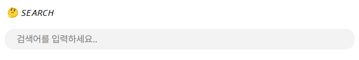

# 폼(Form) 개념서

:::note
프론트엔드 중요 개념 - <mark>HTML 내용 정리 3편</mark>입니다.

프론트엔드 프로그래밍의 기반이 되는 개념 입니다.
:::


## HTML Forms 기본개념


`<form>`은 <mark>사용자의 입력을 서버로 전송하기 위한 태그</mark>입니다. 로그인·회원가입을 위해서 입력해야 하는 **username, id, password** 검색을 위해 검색창에 입력해야 하는 **검색어** 같은 입력 데이터를 전송합니다.

회원가입 예시 코드를 보면서 form 구조에 대해 살펴보도록 합시다.

```jsx
<form action="/signup" method="POST">
  <label for="email">이메일</label>
  <input type="email" id="email" name="email" required placeholder="example@mail.com">

  <label for="password">비밀번호</label>
  <input type="password" id="password" name="password" minlength="8" required>

  <button type="submit">가입하기</button>
</form>
```
### `<form>` 속성

- `action` 데이터를 전송할 서버 주소(URL)
- `method` HTTP 메서드 (GET/POST)

```jsx
<form action="/signup" method="POST"></form>
<form action="/login" method="GET"></form>
```
<br/>

### `<input>`⌨️

- `type` text checkbox date email color range search 등
- `name` 서버로 전송될 key값
- `value` 현재값 / 기본값
- `placeholder` 입력 전 예시 문장
- `required` 입력필수
- `disabled` 입력불가이며 전송 안됨
- `readonly` 입력불가이며 전송됨
- `minlength`, `maxlength` 길이 제한
- `autocomplete` : 브라우저 자동 완성 제어

```jsx
<input type="text" name="username" value="Anonymous">
<input type="email" name="email" placeholder="myemail@mail.com" required>
<input type="password" name="password" minlength="8" required>
```
<br/>


### `<textarea>`⌨️

여러 줄 입력이 필요할때

```jsx
<textarea name="comment" rows="5" cols="40" placeholder="내용을 입력하세요"></textarea>
```
<br/>


### `<select>` & `<option>`⌨️

드롭다운 선택 메뉴

```jsx
<select name="country">
  <option value="KR">한국</option>
  <option value="US">미국</option>
</select>
```
<br/>


### `<button>` / `<input type=”submit”>`✨

```jsx
<button type="submit">가입하기<button>
<input type="submit" value="가입하기">
```

### HTML Input Validation (입력 검증)

```jsx
<form>
  <label for="email">이메일</label>
  <input type="email" id="email" name="email" required placeholder="example@mail.com">

  <label for="age">나이</label>
  <input type="number" id="age" name="age" min="18" max="99" required>

  <label for="password">비밀번호</label>
  <input type="password" name="password" pattern="^(?=.*\d).{8,}$" required placeholder="숫자 1개 이상 포함, 8자 이상">

  <input type="submit" value="제출">
</form>

```
JavaScript 없이도 input에 유효성 검사를 해주는 속성들입니다.

- `pattern` 정규식 패턴 검사
- `required` 빈 값 제출 방지
- `type="email"` 이메일 형식 검사
- `min` / `max` 숫자 범위 제한
- `minlength` / `maxlength` → 최소/최대 글자 수 제한

해당 조건을 지키지 못할시, 브라우저마다 다른 경고 UI가 제공됩니다.

➕ 클라이언트에서의 검증은 편의용일뿐, 서버측에서도 필수적으로 재검증 해야함!.