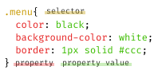
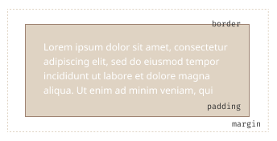

# CSS 기초 & 기본기 다지기

:::note
웹 페이지를 꾸미는 데 꼭 필요한 <mark>CSS의 기본 개념과 구조</mark>를 정리했습니다.
:::

## 3.1. Learn the basics
:::info
- [CSS 기초 \& 기본기 다지기](#css-기초--기본기-다지기)
  - [3.1. Learn the basics](#31-learn-the-basics)
    - [CSS란?](#css란)
    - [CSS ruleset](#css-ruleset)
      - [여러 요소 선택하기](#여러-요소-선택하기)
      - [선택자 종류](#선택자-종류)
      - [박스 모델](#박스-모델)
    - [CSS 적용 우선 순위(Cascading)](#css-적용-우선-순위cascading)
    - [단위 (units)](#단위-units)
    - [색상 표현 방식](#색상-표현-방식)

:::

### CSS란?

CSS는 `Style sheet` 언어입니다. HTML 문서에 있는 요소들에 원하는 스타일을 적용하기 위한 언어입니다. 각 요소에 `색`, `크기`, `배경`, `여백` 같은 스타일을 선택적으로 적용할 수 있습니다.

---

### CSS ruleset
CSS는 기본적으로 `rule set`(규칙 집합) 구조로 작성합니다.


```css
.menu{
  color: black;
  background-color:white;
  border : 1px solid #ccc;
}
```
rule set 규칙
- 각각의 rule set은 `{}`로 감싸진다
- 각 속성과 속성 값을 구분하기 위해 콜론 `:` 사용
- 각각의 rule set 안에 선언을 구분하기 위해 세미콜론 `;` 사용

구성요소
- <mark>선택자 (Selector)</mark> : 스타일을 적용할 HTML 요소 → `.menu`
- <mark>선언 (Declaration)</mark> : `color: black` 같은 단일 규칙
- <mark>속성 (Property)</mark> : 어떤 스타일을 적용할지 지정 → `color` `border`
- <mark>속성 값 (Value)</mark> : 속성에 적용될 값 → `black` `1px solid #ccc`
<br/>

#### 여러 요소 선택하기
여러 요소를 동시에 선택해서 스타일을 적용할 수 있습니다.
```css
p, li, span{
  color : red;
}
```

---

#### 선택자 종류
| **선택자 이름** | **선택** | **예시** |
| --- | --- | --- |
| 요소 선택자 | 특정 태그 전체 | `p` : `<p> 를 선택` |
| 아이디 선택자 | 특정 id를 가진 요소 . | `#myId` : `<div id="myId">` |
| 클래스 선택자 | 특정 class를 가진 요소 | `.myClass` : `<div class="myClass">` |
| 속성 선택자 | 특정 속성을 갖는 요소. | `img[src]` : `` |
| 수도 클래스 선택자 | 특정 상태일 때 | `a:hover` : `<a>`에 마우스 올렸을 때 |

---


#### 박스 모델

HTML 요소들은 박스로 생각할 수 있습니다.



`content` 요소의 실제 내용이 들어가는 공간

- `padding` content 주위 내부 여백
- `border` padding 바깥쪽의 테두리
- `margin` 요소의 외부 여백
- `width` content의 너비 
- `background-color` 요소의 배경색
- `color` content 색 (글자색)


---
### CSS 적용 우선 순위(Cascading)

`CSS`는 `Cascading Style Sheets`의 약자입니다. CSS가 `Cascading`(계단식) 이라는 이름을 가진 것처럼 여러 스타일 규칙이 겹쳐 적용될때, <mark>규칙에 따라 우선순위를 결정</mark>합니다.

1. 명시도 (Specificity) : #id > .class > tag 순서로 적용
2. 코드 작성 순서 : 명시도가 같다면, 뒤에 작성된 규칙이 적용
3. !important : 최우선으로 적용


---

### 단위 (units)

CSS에서는 크기와 간격을 표현하기 위해 다양한 단위를 사용합니다.
- `px` : 절대 단위
- `%` : 부모 요소를 기준으로 한 상대 단위
- `em` : 현재 요소의 글꼴 크기를 기준으로 한 상대 단위
- `rem` : 최상위 요소의 글꼴 크기를 기준으로 한 상대 단위
- `vh/vw` : 뷰포트의 높이와 너비를 기준으로 하는 단위

```html
<html style="font-size: 15px">
  <div style="font-size: 10px;">
    <p style="font-size: 5px;">이 텍스트 크기는 5px</p>
    <p style="font-size: 2em;">이 텍스트 크기는 20px (10px * 2)</p>
    <p style="font-size: 2rem;">이 텍스트 크기는 30px (15px * 2)</p>
  </div>
</html>

```

---

### 색상 표현 방식

CSS에서는 색상을 표현하기 위해 다양한 방식을 사용합니다.

- 이름 : `white` `blue` `red`
- HEX : `#cccccc` (회색)
- RGB : `rgb(225,0,0)` (빨강)
- RGBA : `rgb(225,0,0, 0.1)` (빨강에 투명도 10%)

---
