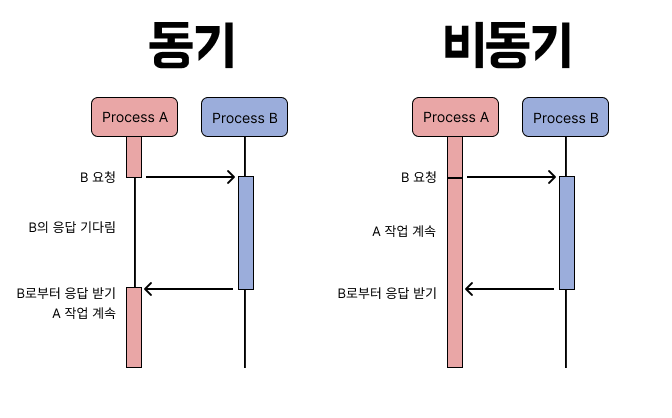
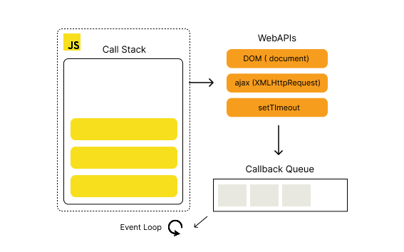

# 자바스크립트의 비동기 이해하기

:::note
프론트엔드 중요 개념 - <mark>Javascript 내용 정리 2편</mark>입니다.
웹 사이트의 복잡한 동작들을 구현할 수 있는 JavaScript의 작동 방식과 비동기 개념입니다.
:::

## 4.1. Learn the Basics

### 동기와 비동기

프로그래밍에는 크게 두 가지 실행 방식이 있습니다.





- **동기(Synchronous)**: 코드가 작성된 순서대로 한 번에 하나의 작업을 처리. 각 작업이 끝날때까지 다음 작업은 기다림.
- **비동기(Asynchronous)**: 작업 완료를 기다리지 않고 작업을 동시에 여러 작업 실행. 작업이 끝나면 결과를 알려주는 방식.

동기 방식은 구현이 쉽고 직관적이지만, 오래 걸리는 작업이 있으면 전체 프로그램이 그동안 멈춰버립니다. 반대로 비동기 방식은 코드 실행 시간이 짧지만, 그에 따른 여러 문제들이 발생할 수 있습니다.

---

## 자바스크립트에서는?

자바스크립트는 **싱글스레드 언어**입니다. 즉, 한 번에 한 가지 작업만 처리할 수 있습니다. 그런데 브라우저 환경에서 네트워크 요청 `fetch()`, 파일 선택 `showOpenFilePicker()` 같은 작업은 시간이 오래 걸릴 수 있습니다. 만약 동기 방식으로 처리하면, 응답을 기다리는 동안 브라우저 전체가 멈추게 됩니다.

이를 해결하기 위해서 자바스크립트는 <mark>**비동기 API**</mark>를 제공합니다. 오래 걸리는 작업을 백그라운드에서 처리하고, 완료되면 콜백 함수를 실행하는 방식입니다. 이렇게 하면 브라우저가 멈추지 않고 다른 작업을 계속할 수 있습니다.

:::warning
좀 더 설명을 보충하자면.. 싱글스레드 언어라는 뜻은 `JavaScript` 엔진 실행 구조 자체가 하나의 `JS 함수`만을 실행할 수 있다는 구조라는 의미입니다. 동기 실행 방식은 논리적 실행흐름으로 작업을 순차적으로 (한 작업이 끝나야 다음 작업이 실행)된다는 의미입니다. `JavaScript`는 싱글스레드지만, 브라우저가 비동기 실행 방식을 지원하기때문에 비동기 실행도 가능해진 것입니다.
:::

---

### 자바스크립트 병렬 처리 원리

자바스크립트는 싱글 스레드 언어입니다. 즉, 한 번에 한 작업만 실행할 수 있습니다. 하지만 실제로 웹 브라우저에서 동작할때는 동시에 여러작업을 진행하는 것처럼 보입니다.

어떻게 자바스크립트가 이를 가능하게 하는지, JS의 이벤트 루프 `Event Loop`와 콜 스택 `Call Stack` 개념을 알아보겠습니다.



1. **Call Stack**: 자바스크립트 코드가 실행되는 메인 스레드 공간.

2. **Web API**: 브라우저가 제공하는 별도의 기능들로 브라우저가 자체적으로 멀티스레드로 처리.

3. **Task Queue (Callback Queue)**: `Web API` 작업이 완료되면 그 결과로 실행해야 할 콜백이 들어오는 대기열.

4. **Event Loop**: `Call Stack`이 비면 `Task Queue`에 있는 콜백을 가져와 실행.

<br/>
<br/>

#### 전체적인 흐름

1. `Call Stack`에서 자바스크립트 코드가 순차적으로 실행됩니다.

2. 오래 걸리는 작업(예: 네트워크 요청, 타이머)은 `Web API`로 넘깁니다.

3. `Web API`는 해당 작업을 백그라운드에서 멀티스레드로 처리합니다.

4. 작업이 완료되면 콜백을 `Task Queue`에 등록합니다.

5. `Event Loop`가 `Call Stack`이 비어 있는지 확인하고, 비어있다면 `Task Queue`에서 콜백을 꺼내 실행합니다.

즉 요청은 브라우저(Web API)가 처리하고, 실행은 JS 엔진(Call Stack)이 담당하는 구조입니다.

<br/>

코드 예시
```jsx
console.log("시작");
setTimeout(() => {
  console.log("3초 후 실행");
}, 3000); // 
console.log("끝");
```
1. `시작` 출력
2. setTimeout 호출 -> 브라우저(Web API)가 3초 대기
3. JS 엔진은 다음 코드로 넘어감 -> `끝` 출력
4. 3초 대기 완료 후, 콜백이 task Queue에 들어간 뒤 Event Loop에 의해 실행 -> `3초 후 실행` 출력

<br/>

📌 결론  
자바스크립트는 싱글스레드이지만, 브라우저가 제공하는 Web API(멀티스레드) 덕분에 비동기 작업을 처리할 수 있다!

---
#### 콜백 실행은 싱글스레드인 이유

fetch, setTimeout 같은 작업은 브라우저(Web API)가 멀티 스레드로 처리하지만, 그 이후 콜백 실행은 여전히 싱글 스레드(Call Stack) 위에서 이루어집니다.

JS가 콜백 실행을 Call Stack에서 처리하도록 한 이유는 **동시성 문제(concurrency issue)**를 회피하기 위해서입니다. 멀티스레드 환경에서는 두 스레드가 동시에 같은 변수를 수정하는 경우, DOM을 동시에 수정하는 경우가 발생할 수 있기 때문에 최종적인 자바스크립트 코드 실행은 Call Stack에서 안전하게 처리됩니다. (한 줄씩)


---

### 비동기의 단점 : 콜백 지옥

비동기 처리에는 순서 맞추기가 어렵다는 큰 단점이 있습니다. 다음 작업을 하는데, 이전 작업의 결과를 필요로 할때, 단순한 콜백 방식으로 코드를 짜면 코드가 복잡해집니다. 이를 콜백 지옥이라고 부릅니다.

```jsx
getData((result1) => {
  processData(result1, (result2) => {
    saveData(result2, (result3) => {
      console.log("작업 완료!", result3);
    });
  });
});
```
이 코드는 `getData` -> `processData` -> `saveData` 순서대로 실행해야할때 작성된 예시로 코드 가독성이 떨어집니다.

### 해결방법

#### callback함수기법
비동기 결과를 전달받기 위해 함수의 매개변수에 함수를 넘기는 방식입니다.

```jsx
function printMessage(message) {
  console.log(message);
}

function work(callback) {
  setTimeout(() => {
    callback("작업 완료!");
  }, 1000);
}

work(printMessage);
```

#### Promise 객체
비동기 작업을 객체로 다루며, `then`과 `catch`로 결과와 오류를 처리합니다.
```jsx
const work = new Promise((resolve, reject) => {
  setTimeout(() => {
    resolve("작업 성공!");
  }, 1000);
});

work.then((message) => console.log(message));
```

#### async / await 사용
Promise를 더 직관적으로 사용할 수 있는 문법입니다. 동기 코드처럼 읽히지만 내부적으로는 비동기입니다.
```jsx
const work = new Promise((resolve, reject) => {
  setTimeout(() => {
    resolve("작업 성공!");
  }, 1000);
});

async function run() {
  const message = await work;
  console.log(message);
}

run()
```

보통 callBack 함수는 심플한 비동기,  
Promise는 복잡한 비동기 구현에 사용합니다.


---
:::warning
📌 정리

- 동기 함수는 작업이 끝날 때까지 다음 코드를 막음 → 오래 걸리면 프로그램이 멈춘 듯 보임  
- 비동기는 작업을 시작하고 바로 다음 코드 실행 → 결과는 나중에 이벤트나 콜백으로 받음  

자바스크립트는 싱글스레드지만, 브라우저(Web API)가 멀티스레드를 지원해 비동기 처리가 가능  
비동기 문제(콜백 지옥)는 Promise와 async/await으로 해결
:::

참고
[`Introducing asynchronous JavaScript`](https://developer.mozilla.org/ko/docs/Learn_web_development/Core/Scripting/A_first_splash) [`🌐 자바스크립트의 핵심 '비동기' 완벽 이해 ❗`](https://inpa.tistory.com/entry/%F0%9F%8C%90-js-async)