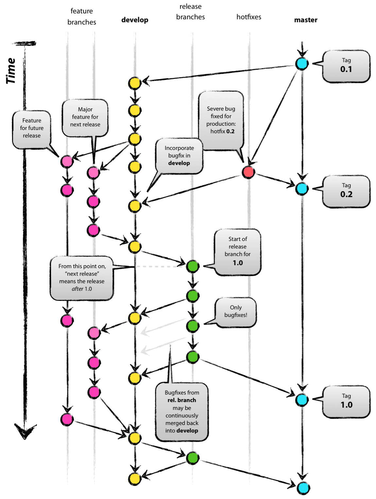
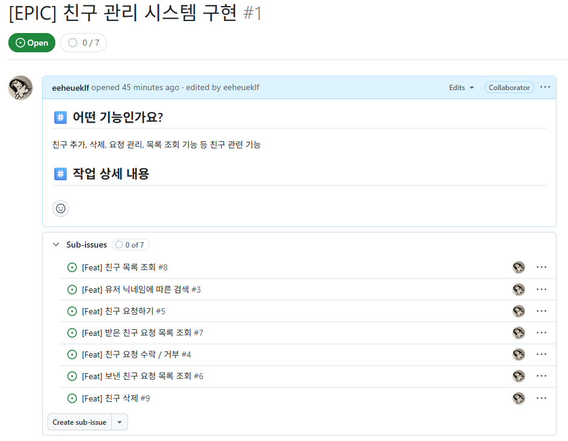
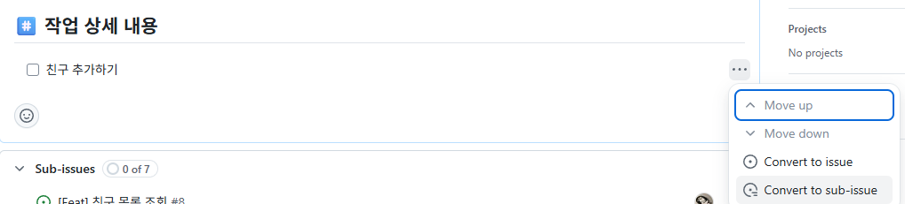
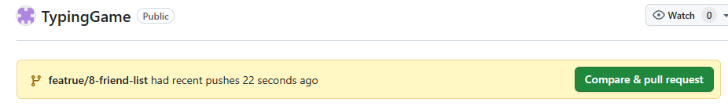

# 프론트엔드 개발자를 위한 Git 사용법 


:::note
프론트엔드 개발을 하다 보면, 효율적인 버전 관리와 개발 과정의 정리를 위해 VCS를 적극 이용해야합니다. 프론트엔드 개발자 관점에서 <mark>Git과 GitHub, Git FLow 전략의 활용</mark>에 대해 정리해 보았습니다.
:::


## VCS란 ?

**버전관리시스템**(`Version Control System`, `VCS`)는 파일 변경 사항을 시간에 따라 기록하고, 필요시 특정 시점으로 되돌릴 수 있는 시스템입니다. 

코드를 작성하다 보면, 생각보다 이전 수정 사항을 확인해야 할 때가 많고, 잘못 수정했을 때 이전 버전으로 복원해야 할 때도 있습니다. 이럴 때 `VCS`를 통해 변경 사항을 추적하고, 이전 버전으로의 복원 등이 가능합니다.

#### VCS의 종류 

VCS는 저장 위치와 수정 방법에 따라, **로컬/중앙서버/분산** 방식으로 분류할 수 있습니다.
- `LVCS` 로컬 컴퓨터에서 버전 관리
- `CVCS` 서버에서 최종본 관리, 수정을 원하는 파일만 로컬에서 수정
- `DVCS` 서버와 로컬에서 파일 관리, 전체 프로젝트를 로컬에서 수정

## Git 이란

Git은 대표적인 `DVCS`(분산 VCS)로 소프트웨어 개발 과정에서 필요한 문서, 소스코드들을 관리하는 도구입니다. 프로젝트 할때 거의 필수적으로 사용됩니다.

Git의 특징은 다음과 같습니다.

1. **Branch 관리가 가볍다** : 독립적인 작업 환경을 쉽게 만들고 병합할 수 있다
2. **Staging 영역 제공** : 커밋 전에 선택적으로 변경 사항을 준비할 수 있다
3. **분산처리 구조** : 로컬에서도 모든 히스토리 관리를 할 수 있다
4. 속도가 빠르다

## Github

GitHub는 클라우드 서버를 통해 Git 저장소의 코드를 업로드하고 공유할 수 있는 호스팅 서비스입니다. 로컬 저장소에서 작업한 코드를 업로드하여 백업이 가능하고, 여러 개발자가 함께 작업하며 협업 가능합니다.

## Git Flow

Git Flow는 <mark>기능 개발, 배포, 버그 수정 등 상황에 맞게 **브랜치를 분리하여 관리**하는 방법</mark>입니다.

현업에서도 많이 사용하는 방법이라고 들었고, 저도 저번 프로젝트에 간접적으로 참여해보았는데, 기능 단위 작업을 관리하는 데에 활용하기 좋은 것 같아서 소개해봅니다. (개인/소규모 프로젝트에서 미리 적용해봅시다!)


일단 기본적인 Git Flow 전략은 다섯개의 브랜치를 활용하여 진행합니다.
- main: 실제 서비스에 배포되는 브랜치
- develop: 개발용 통합 브랜치
- feature/: 기능 단위 브랜치
- release/: 배포 준비용 브랜치
- hotfix/: 서비스 중 긴급 수정용 브랜치
  


### Git Flow 적용해보기

개인/소규모 프로젝트에서는 `main`과 `feature/` 브랜치만 사용하여 개발하는 것이 효율적인 것 같습니다. 추가로 프론트엔드 개발에서는 style(UI) 수정이 `feature/` 브랜치에 들어가는 것은 약간 애매하기 때문에 따로 `ui/` 브랜치를 활용하는 것도 좋은 것 같습니다.

Git Flow 개발 프로세스는 Issue → Branch → Commit → Pull Request 순서대로 진행합니다. 순서를 따라가면서 바로 진행해봅시다. 저는 제가 하고 있는 프로젝트(백1명, 프론트1명)에 적용해 보았습니다.

---

1. **Issue 작성하기**

- EPIC 라벨을 만들어 큰 Issue 단위 잡기
- 세부 Task Issue들을 sub-issue로 연결하기
  
개발해야할 필요한 기능들을 Issue로 작성해봅시다. 

여기서.. Issue 기준을 미리 정하고 가야하는데요. 너무 작게 쪼개면 관리가 귀찮고, 너무 크게 묶으면 또 그것대로 관리가 힘듭니다.

저는 일단 친구 관리 시스템이라는 큰 `Issue`를 잡아두고, 작은 `Task Issue`들을 쪼개서 작성해보았습니다.



:::tip
checkList에서 sub-issue로 issue를 분리할 수가 있습니다.


:::

---

2. **branch 분리**

main에서 각 sub-issue에 맞는 기능 브랜치를 생성하고 이동합니다.
```bash
git checkout main
git checkout -b feature/login
```

해당 브랜치에서 개발 후 `git add` + `git commit`으로 변경 사항을 기록합니다.



:::tip
커밋시 메시지에 해당 기능에 맞는 issue 번호를 연결할 수 있습니다.  
git commit -m "[Feat] 친구 목록 조회 UI 구현 (#8)"

:::

---


3. merge

main 브랜치로 돌아가서 병합

```bash
git checkout main
git pull origin main
git merge feature/login
# (기능 개발 완료되었으면) 기능 브랜치 삭제 
git branch -d feature/login
```

