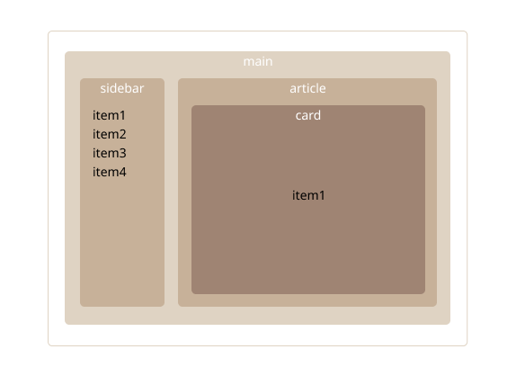

# React Context API


## 들어가며
다음과 같이 하나의 item을 여러 컴포넌트에서 사용하는 구조가 있습니다.



```
main
├ sidebar
└ article
  └ card
```
- `sidebar` : item list 표시 및 선택  
- `card` : 선택된 item 표시  

여기서 `sidebar`에서 선택한 `item`이 `main > article > card`까지 전달되어야 하므로 `props` 전달 과정이 복잡해질 수 있습니다. (main이나 article에서는 item이 안쓰이는데 전달됨)

이 문제를 해결하기 위해서 만들어진 것이 **React Context API**입니다.

## 사용방법

1. context 생성

```jsx {3}
import { createContext } from "react";

export const ItemContext = createContext();
```

2. Provider로 값 제공
```jsx title="mainPage.jsx" {4,11}
import React, { useState } from "react";
import Sidebar from "./Sidebar";
import Card from "./Card";
import { ItemContext } from "./MainPage";

export default function MainPage() {
  const [selectedItem, setSelectedItem] = useState(null);
  const items = ["item1", "item2", "item3", "item4"];

  return (
    <ItemContext.Provider value={{ selectedItem, setSelectedItem }}>
      <div style={{ display: "flex", gap: "20px" }}>
        <Sidebar items={items} />
        <Card />
      </div>
    </ItemContext.Provider>
  );
}
```

3. useContext로 값 사용 
```jsx title="sidebar.jsx" {5,13}
import React, { useContext } from "react";
import { ItemContext } from "./MainPage";

export default function Sidebar({ items }) {
  const { setSelectedItem } = useContext(ItemContext);
  // setSelectedItem으로 아이템 선택
  return (
    <ul>
      {items.map((item) => (
        <li
          key={item}
          style={{ cursor: "pointer", margin: "5px 0" }}
          onClick={() => setSelectedItem(item)}
        >
          {item}
        </li>
      ))}
    </ul>
  );
}
```
```jsx title="card.jsx" {5,9}
import React, { useContext } from "react";
import { ItemContext } from "./MainPage";

export default function Card() {
  const { selectedItem } = useContext(ItemContext);

  return (
    <div style={{ border: "1px solid #ccc", padding: "10px", width: "200px" }}>
      <p>선택된 아이템: {selectedItem}</p>
    </div>
  );
}
```
### Context API의 사용처

Context API는 간단한 전역 상태에 적합하고, 상태가 바뀌면 Provider 하위 모든 컴포넌트가 리렌더링되기 때문에, 상태가 자주 바뀌면 성능 문제가 발생할 수 있습니다.

1. 테마 토글
2. 언어 설정
3. 로그인 유저 정보
4. 현재 선택된 메뉴
5. 사이드바/ 모달 열림 상태 등 UI 상태 공유

## Props vs Context

Props는 부모가 자식한테 데이터를 전달하는 방법으로 전달받는 데이터는 읽기 전용입니다.  
하지만 자식 컴포넌트 이상으로 데이터를 전달하려면 중간 단계의 컴포넌트에서 불필요하게 데이터를 처리하는 문제가 발생합니다. 

:::tip
프론트엔드를 설계할때, 프로젝트에서 어떤 컴포넌트가 상태를 제공하고 어떤 컴포넌트가 사용할 지 미리 구조를 설계하면 좋을 것 같습니다.
:::

## context api 특징
- 특정 컴포넌트에서 제공하는 데이터를 자식을 포함한 하위 컴포넌트에서 사용할 수 있음  
- **컴포넌트 모듈화 가능** : 제공하는 컴포넌트와 사용하는 컴포넌트를 분리하여 재사용  
- 동일 context 중첩 시, 자신과 가장 가까운 상위 Provider의 데이터를 사용  
