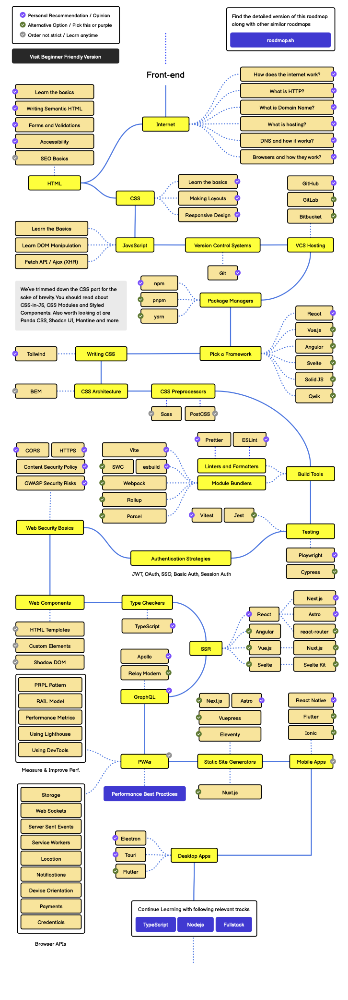

# 🍪 프론트엔드 필수 개념 정리

:::note
프론트엔드 개발자 취업준비를 위해

<mark>**프론트엔드 로드맵 2025**를 따라 중요한 프론트엔드 개념</mark>을 정리해보았습니다.

참고하시고 도움이 되었으면 좋겠습니다.
:::

## 1. 인터넷
:::info

### 인터넷 동작 방식

인터넷 작동 기본 원리

- 인터넷 | **네트워크** | 분산네트워킹 | 라우터,스위치

인터넷에서의 데이터 이동

- 패킷 | 헤더 | **패킷스위칭** | 프로토콜 | **IP**
:::

:::info
### HTTP란?

HTTP 기본 내용

- **HTTP란?** | HTTP요청 | HTTP응답

HTTP 특징

- **무상태와 비연결성** | 쿠키🍪 | 세션

상태 유지🍪

- 쿠키🍪 | SessionStorage | LocalStorage

전반적인 개념 정리

- HTTP vs HTTPS 

- API | REST API | RESTful API 

- CORS
:::

:::info
### 도메인 이름이란?

- 도메인 이름 | URL | URI | DNS

:::

:::info
### DNS는 무엇이고 어떻게 작동하는가?

- DNS | IP주소 | 캐시
:::

:::info
### 호스팅이란?
- 웹서버 | 호스팅 | 호스팅 종류
:::

:::info
### 브라우저는 어떻게 작동하는가?
웹 사이트 접속 흐름 - 브라우저(browser)
- 웹페이지탐색 | 렌더링 | TCP핸드셰이크
:::

출처 : Developer Roadmaps - Frontend Roadmap