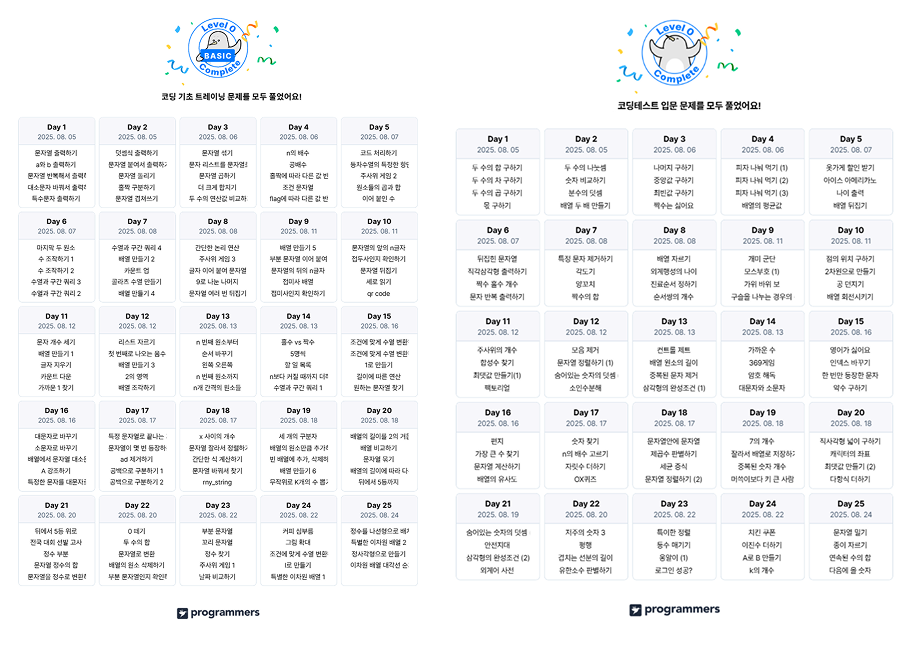

# [회고] 기초 입문 달성 후기 🥳🎉

`2025.08.24`

프론트엔드 코딩테스트 준비겸 JS 기본기를 익히기를 목표로 프로그래머스 기초 및 입문 트레이닝을 3주동안 풀었습니다. 기초, 입문 각 25일씩 `Lv.0` 문제를 풀어보는 과정이었는데요, 저는 전공자라 하루에 기초+입문 2 Day씩 달렸습니다!

초반에는 1시간정도 걸렸고, 후반에는 2시간, 어려울때는 3시간까지 문제 풀이에 시간을 들인것 같습니다.

프론트엔드 구현에 JavaScript를 쓰긴 썼는데, 기초부터 배운 건 아니어서 메서드 하나하나 알아가면서 풀었는데요, 과정을 완료하는 지금 시점에서 보니 각 메서드들의 쓰임새와 문자열과 배열을 집중적으로 공략하는 과정이어서 좋았던 것 같습니다.

드디어 JS의 기초를 뗀 느낌😊😅

`Lv.0`인데도 쉽지 않은 문제들이 있었지만, JavaScript가 진짜 다른 언어에서는 할 수 없는 기특한 메서드들이 많더라구요.. 길게 풀어야 하는 걸 간단하게 줄여주는 메서드들이 많아서 확실히 아는게 힘이구나 라는 것도 느꼈습니다.

`Lv.0` 끝내고서는 `Lv.1` 차근차근 풀어 볼 예정입니다.. 조금 풀어 보니까 `Lv.0`에서 기초 탄탄하게 하고 왔으면 `Lv.1`은 어려움은 없을 것 같습니다. 빨리 `Lv.2`로 넘어가고 싶네용

참고사항으로는 초반에는 기초와 입문 난이도가 비슷한데, 입문 후반이 좀 어려워져서 기초 입문 따로 하실거면 기초->입문 순서 추천드립니다.

