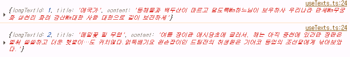
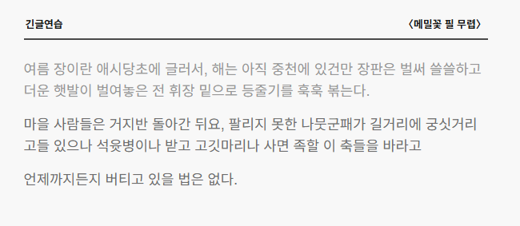

# Split과 정규식 lookbehind 적용

`2025.09.25`

:::note
<mark>제가 공부한 내용을 실제 프로젝트에 적용한 사례를 공유합니다.</mark>  
개발 과정에서 겪은 문제와 해결 방법도 함께 기록하였으니 필요한 부분만 편하게 참고하세요.
:::

:::warning
- 관련 문법  
    `split('')`  💜 문자열을 배열로  
    `replace(pattern, replacement)` 🔄 문자열에서 첫번째 특정 패턴 치환  
    `const result: string[] = []` **TypeScript 문법** 배열에 들어갈 수 있는 타입을 string으로 고정  
    `.trim()` 문자열 양 끝의 공백 제거
- 정규식
    `/(?<=다\.)/g` lookbehind, 앞에 특정 패턴이 있는 위치를 탐색
    `/\s+$/g` 문자열 끝의 모든 공백 제거
:::

---
    
## 배경

[TYLE(사이드프로젝트)](https://github.com/eeheueklf/typinggame)은 25/9/25 기준으로 개발중인 프로젝트로 타자 연습 서비스이다.

서비스 중 긴 글 연습 페이지에서는 글을 선택하면 서버로부터 텍스트를 받아, **타자 연습용으로 한 줄 단위로 분리**해야 했다.

:::note


예시1 애국가  
*동해물과 백두산이 마르고 닳도록\n하느님이 보우하사 우리나라 만세\n무궁화 삼천리 화려 강산\n대한 사람 대한으로 길이 보전하세*

예시2 메밀꽃 필 무렵(이효석)  
*여름 장이란 애시당초에 글러서, 해는 아직 중천에 있건만 장판은 벌써 쓸쓸하고 더운 햇발이 벌여놓은 전 휘장 밑으로 등줄기를 훅훅 볶는다.마을 사람들은 거지반 돌아간 뒤요, 팔리지 못한 나뭇군패가 길거리에 궁싯거리고들 있으나 석윳병이나 받고 고깃마리나 사면 족할 이 축들을 바라고 언제까지든지 버티고 있을 법은 없다. 춥춥스럽게 날아드는 파리떼도 장난군 각다귀들도 귀치않다.얽둑배기요 왼손잡이인 드팀전의 허생원은 기어코 동업의 조선달에게 낚아보았다.*
:::


## 문제상황

- 일반적으로 시의 경우는 줄바꿈 문자`\n`을 기준으로 `split`하면 됨
- 하지만 소설/수필은 줄바꿈이 없는 경우가 많아서 한 줄을 구분하는 방법이 필요함
- 한 줄의 최대 길이 `maxLength`를 기준으로 잘랐을 때 줄 끝에 공백이 남아 줄 끝의 식별이 어려움

처음에는 단순히 줄바꿈을 기준으로 `split`하고, 그 이후 `maxLength` 기준으로 나누는 **splitByLength** 함수를 만들었지만, 직접 타자 연습을 해보니 문장 단위로 끊겨 있지 않아 타자 연습의 흐름이 끊긴다는 문제점을 발견했다. 또한 `maxLength`의 끝 부분이 공백일 경우, 공백이 그대로 남아 한 줄의 끝을 정확히 파악할 수 없었다.


## 해결 방법

```jsx
export const splitByLength = (text: string, maxLength: number): string[] => {
  
  const lines = text.split(/\n|(?<=다\.)|(?<=\.\")|(?<=\?\")/g).map(line=>line.trim()).filter(line => line.length > 0);
  const result: string[] = [];

  lines.forEach(line => {
    if (line.length <= maxLength) {
      result.push(line);
    }
    else {
      for (let i = 0; i < line.length; i += maxLength) {
        const segment = line.slice(i, i + maxLength).trim();
        result.push(segment);
      }
    }
  });

  return result;
};
```

한국 수필/소설은 대부분 `-다.`, `?"` ,`."`로 문장이 끝나는 점을 고려하여 문장 단위 `split`을 구현하였다.

Split 기준
- `\n` : 줄바꿈 문자
- `(?<=다\.)` : `다.`
- `(?<=\.\")` : `."`
- `(?<=\?\")` : `?"`

추가 고려 사항
- `split` 하였을때 발생하는 공백을 `trim()`으로 제거
- 길이가 0인 줄은 제거
- maxLength보다 긴 문장은 반복문으로 잘라서 배열에 추가





## 알게된 점

`(?<=...)` 형태의 정규식 lookbehind는 앞에 특정 패턴이 있을 때의 위치를 찾는다.

lookbehind는 구형 브라우저에서는 지원되지 않다고 하니, 필요시 split으로 대체할 수 있다. (최신 Chrome, Edge 등에서는 정상 동작 확인)

정규식 이 녀석이 참 안 들어오는데, `replaceAll`없이도 `replace + /g`를 활용하면 문자열 전체에 적용이 된다는 사실!