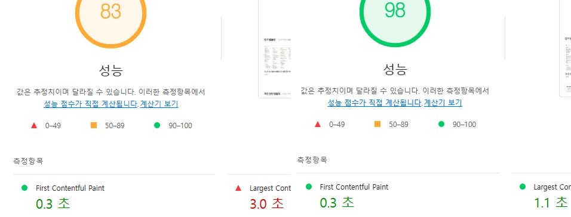
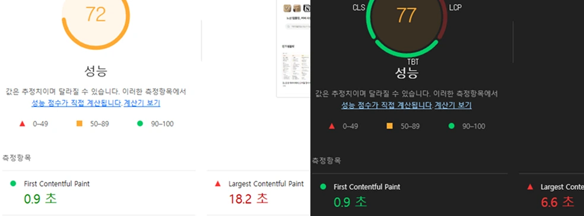

## LCP 9.8초의 의미

**LCP**(`Largest Contentful Paint`)는 페이지의 가장 큰 핵심 콘텐츠가 화면에 나타나는 시점이다.  
이는 웹 성능 지표 중 사용자가 느끼는 실제 로딩 속도를 결정짓는 중요한 지표이다.

초기 측정 결과, 데스크탑 LCP는 `3.0초`, 모바일 LCP는 `18.2초`라는 충격적인.. 수치를 기록했다.  
`18초`는 사용자가 자신의 와이파이가 문제가 있지는 않을까 다시 생각해보게될것 같은 시간이다.  
이를 개선하기 위해 폰트, 이미지, JS 번들, 렌더링 전략에 걸친 **대-최적화**를 진행했다!
<br/>


---

## 이미지 최적화


가장 큰 문제는 메인 화면에서의 대량 이미지 로딩으로 인한 지표 하락이었다.
```tsx
<Image 
    src={template.thumbnail_url || "/no-img.webp"} 
    alt={template.title} 
    quality={50}
    sizes="(max-width: 768px) 100vw, 300px" 
    priority={index < 3}
/>
```
- `priority` : 초기 뷰포트에 나타나는 이미지에 `priority`를 부여했다. 이를 통해 브라우저는 다른 리소스보다 먼저 로드하게 된다.
- `quality` : 시각적 품질을 해치지 않는 선에서 50으로 조정했다.
- `sizes` : 모바일 환경과 데스크탑 환경에서의 이미지 크기를 조정했다.


## 폰트 & 리소스 포맷 최적화

다음으로 데이터 크기 자체를 줄였다. LCP 지표에 영향을 주는 폰트, 이미지 로딩에 관한 사항이다.

- **TTF -> WOFF2 변환** : 기존 `ttf` 대비 75%이상 압축되는 `woff2` 포맷으로 변경하였다.
- **이미지 압축** : 기존 `webp` 대비 30% 가량 압축되는 `WebP`형식을 기본으로 사용하도록 설정했다.
  


## JS 번들 최소화
모바일 환경에서는 데스크탑 환경에서보다 성능이 좋지 않아 자바스크립트 해석 및 실행 과정에서 병목이 크게 발생한다.
따라서 초기 렌더링에 당장 필요 없는 컴포넌트를 분리했다.

```tsx
// 검색바 컴포넌트 지연 로딩
const HomeSearchBar = dynamic(() => 
    import("@/components/search/SearchBar").then(mod => mod.HomeSearchBar), 
    { 
        ssr: true, 
        loading: () => <div className="h-[46px] w-full max-w-[320px] bg-gray-100 animate-pulse rounded-full" /> 
    }
)
```
- **Dynamic Import**: 검색바와 같이 로직이 무거운 컴포넌트를 `dynamic`으로 호출하여 초기 JS 번들 크기를 줄였다.
- **Skeleton UI**: `loading` 실제 검색바와 높이가 같은 `Skeleton UI`를 제공했다. `Skeleton`은 사용자의 체감 대기 시간을 줄이며, `CLS`또한 방지할 수 있다.

## 최종 성과 및 결과
최적화 적용 후, 데스크탑은 물론이고 가장 심각했던 모바일 환경에서 유의미한 수치 변화를 확인했다.


:::warning
**데스크탑 환경에서 LCP 3.0 -> 1.1 (약 63% 단축)**




**모바일 환경에서 LCP 18.2 -> 6.6 (약 64% 단축)**



:::

