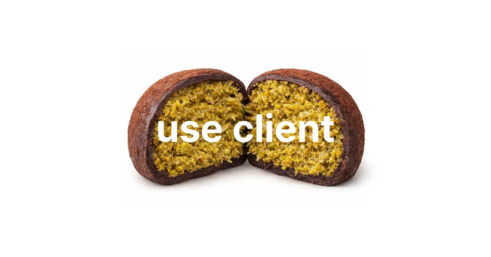
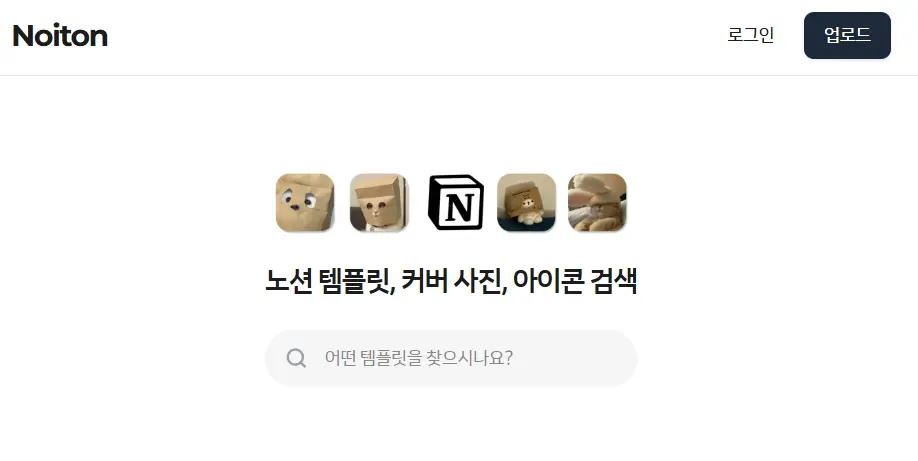

*이전 글인 [Next.js가 함정이었던 타자 연습 프로젝트 회고](/blog/next-sidepj)에서 겪었던 Next.js에 대한 경험을 바탕으로, 새 프로젝트에서는 어떻게 적용하고 개선했는지에 대해 정리한 글이다.*

## 들어가며 
이전 프로젝트에서 모든 페이지에 `use client`를 남용하면서 설계의 중요성을 깨달았다. 이번 프로젝트에서는 Next.js App Router의 핵심인 서버/클라이언트 분리 원칙을 설계하는데 집중했다. 어떻게 지킬 것인지 **세가지의 규칙**을 세우고 개발을 시작했다.

<br/>

> 1. `app/` 폴더 내의 `Layout`과 `Page`는 기본적으로 서버 컴포넌트로 작성한다.
> 2. `components/` 폴더 내의 기능 단위 컴포넌트 중, 상호작용이 발생하는 최소 단위만 `use client`를 선언한다.
> 3. 불필요한 것까지 원자 단위로 쪼개지 않는다.(과분리X)


## 실전 적용 코드



메인 화면의 배너와 검색창 섹션을 보면서 어떻게 적용했는지 살펴보자.

컴포넌트 계층 구조를 다음과 같이 설계했다.
- Home (Page / Server): `Home` 페이지 전체 레이아웃, 카테고리별 데이터 페칭 
- HomeVisual (Component / Server): 배너 이미지, 타이틀 구성
- HomeSearchBar (Component / Client): 입력과 페이지 이동이 일어나는 검색창 구성


### 코드분석 

`Home` 페이지는 `HomeVisual`을 호출하고, `HomeVisual`은 내부에서 `HomeSearchBar`를 띄운다. 

```tsx {6}
export default async function Home() {
  const supabase = await createClient();
    // 생략
  return (
    <>
      <HomeVisual/>

      <TemplatePreview .../>
    </>
  );
}
```

`HomeVisual`은 배너부분을 구성한다. 인터렉션이 필요한 검색바만 분리했다.

```tsx {24}
const HomeSearchBar = dynamic(() => 
    import("@/components/(main)/search/SearchBar").then(mod => mod.HomeSearchBar), 
    { 
        ssr: true, 
        loading: () => <div className="h-[46px] ..." /> // skeleton ui
    }
);

export function HomeVisual(){
    return (
        <section>
            <Image src="/search.png" alt="banner" priority /> 
            <h1>노션 템플릿, 커버 사진, 아이콘 검색</h1>
            <HomeSearchBar /> 
        </section>
    )
}
```
`useState`와 `useRouter`가 필요한 최소 단위인 검색바이다. `use client`를 선언하여 분리했다.

```
"use client";
export function HomeSearchBar() {
  const [query, setQuery] = useState("");
  const router = useRouter();

  const handleSearch = (e: React.FormEvent) => {
    e.preventDefault();
    if (!query.trim()) return;
    router.push(`/search?q=${encodeURIComponent(query.trim())}`);
  };

  return (
    <form ...
    >
      ...
      <input 
        type="text" 
        value={query}
        onChange={(e) => setQuery(e.target.value)}
        placeholder="어떤 템플릿을 찾으시나요?" 
      />
    </form>
  );
}
```

## 얻은 것

이러한 서버/클라이언트 분리 기술을 통해 얻은 것은 다음과 같다.

1. **번들 사이즈 및 로딩 최적화**: 배너 이미지를 서버 컴포넌트에 두어 JS 실행 비용을 아꼈다. 또한`next/dynamic`과 `Skeleton UI`를 조합하여 검색바의 자바스크립트가 로드되는 동안에도 배너를 볼 수 있고 레이아웃 시프트 없이 자연스럽게 로드했다.

2. **하이드레이션 범위 축소**: 페이지 전체를 다시 그리는 대신, `HomeSearchBar`만 활성화하여 CPU 부하를 줄였다.

3. **보안, 데이터 플로우 단순화**: API 키나 DB 접근 로직을 서버 컴포넌트 내부에 은닉했다. 클라이언트에 민감한 정보를 노출하지 않고도 서버에서 모든 데이터를 확정 지어 결과만 `Props`로 전달하는 깔끔한 구조를 유지했다.

- [사진 출처] [`easymenu.kr`](https://easymenu.kr/magazin/article/duzzoncu) '화제의 디저트, 두바이 쫀득쿠키'