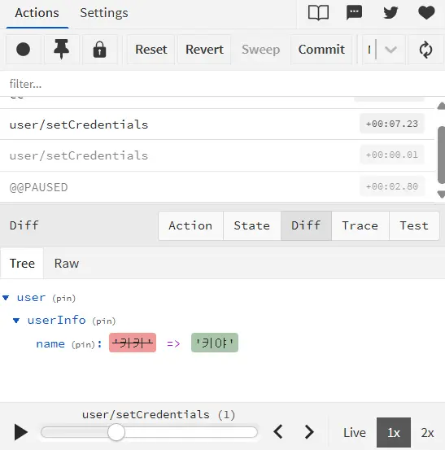

## 들어가며

`next-auth/react`의 `useSession`은 인증 상태를 간편하게 관리할 수 있는 도구이다. 그러나 프로젝트가 커지면서 여러 컴포넌트에서 유저 정보를 동시에 참조하고 수정해야 하는 상황에서는 한계를 드러냈다. 

특히 `ProfileModal` 구현 과정에서, 유저 정보를 수정한 뒤 이를 여러 UI에 즉시 반영해야 했고, 기존 구조에서는 처리하기 비효율적이라고 느꼈다. 이 과정에서 상태 관리 방식 자체를 재설계할 필요성을 느꼈다.


*프로필 설정 창 - ProfileModal*

## 기존 구조의 문제점

### Props Drilling

기존 코드에서 유저 정보는 `NavHeader` -> `AccountDropDown` -> `ProfileModal`로 전달되었다. 중간 컴포넌트는 해당 데이터를 사용하지 않았음에도 전달을 위해 `props`를 유지해야 했다.

이는 컴포넌트 구조가 깊어질수록 유지보수 비용을 증가시키는 원인이 된다.

### UI와 비즈니스 로직의 결합

`ProfileModal` 내부에서 직접 `useSession`, `supabase`를 호출한다.

```tsx
const handleNameUpdate = async (newName: string) => {
  const { error } = await supabase
    .from("users")
    .update({ name: newName })
    .eq("id", session.user.id);

  if (error) throw error;
  await update({ name: newName });
};
```

이 구조는 인증 라이브러리를 변경하거나 데이터베이스 스키마가 바뀌면 모든 컴포넌트를 일일이 수정해야 하며, 테스트 및 재사용이 어렵다.

### 상태 변경 로직의 분산

유저 정보 업데이트 로직이 여러 컴포넌트에 흩어져 있다 보니 이런 문제가 발생한다.
- 어떤 컴포넌트에서 어떤 방식으로 상태를 바꾸는지 추적하기 어려움
- 데이터 동기화 시점이 불명확함
- UI 간 상태 불일치 가능성 존재 

## Redux Toolkit을 통한 상태 통합 전략


문제의 핵심은 **상태 접근 방식과 데이터 흐름이 분산되어 있다**는 점이다.

이를 해결하기 위해 상태를 중앙에서 관리하고, 비즈니스 로직을 분리하는 구조로 개선해보았다.


## 전역 상태 기반 구조로 전환

`Redux Toolkit`을 도입하여 유저 상태를 전역 스토어에서 관리하도록 변경했다. 이제 모든 컴포넌트에서 `props` 없이 직접 상태를 가져올 수 있게 되었다.


```tsx
const { userInfo, isLoggedIn } = useSelector((state: RootState) => state.user);
```


## 비즈니스 로직의 캡슐화

DB 업데이트, 세션 갱신, Redux 상태 동기화를 하나의 `Custom Hook`에서 처리하도록 설계했다. 
```
export function useUserUpdate() {
  const { update } = useSession();
  const dispatch = useDispatch();
  const supabase = createClient();

  const updateName = async (newName: string) => {
    // 1. DB 업데이트
    // 2. NextAuth 세션 동기화
    // 3. Redux 상태 업데이트
  };

  return { updateName };
}
```

## UI 컴포넌트의 역할 축소

UI 컴포넌트가 상태를 사용만 할 수 있도록 하였다.
```tsx
export default function ProfileModal({ isOpen, onClose }: Props) {
  const { userInfo, isLoggedIn } = useSelector((state) => state.user);
  const { updateName } = useUserUpdate();

  if (!isOpen || !isLoggedIn || !userInfo) return null;

  // UI 렌더링만 담당
}
```

## 결과

#### UI 컴포넌트는 독립적으로.

이번 구조 개선에서 가장 먼저 고려한 부분은 컴포넌트의 독립성이었다.  
기존에는 컴포넌트 내부에서 데이터를 가져오기 위한 로직까지 함께 처리해야 했다.

이를 전역 상태 기반 구조로 변경하면서, 컴포넌트는 `userInfo`라는 결과값만 가져다 사용하도록 단순화했다.  

이 과정에서 컴포넌트의 역할이 명확해졌고, 수정 범위도 줄어들어 유지보수성이 개선되었다.

#### 디버깅이 가능한 구조로의 전환

기존에는 상태가 어디서 어떻게 바뀌는지 추적하기 어려웠다.  
여러 컴포넌트에 로직이 흩어져 있어 문제 발생 시 원인을 찾는 데 시간이 소요되었다.

`Redux DevTools`를 도입해보니 상태 변화 흐름을 명확하게 확인할 수 있게 되었다.  
상태를 변경한 `Action`, 변경 시점, 순서를 확인할 수 있었고 이를 기반으로 원인을 파악하는 과정이 훨씬 수월해졌다.



#### 데이터 흐름의 일관성 확보

**1. 서버 업데이트 → 2. 세션 반영 → 3. 전역 상태 갱신**의 상태 변경 순서를 모든 상태 변경 로직에 동일하게 적용했다.  
그 결과 데이터가 항상 같은 흐름으로 처리되면서, UI 간 상태 불일치 문제를 줄일 수 있었다.

---

## 마치며

이번 개선 작업을 통해 상태 관리가 단순히 데이터를 전역으로 저장하는 것이 아니라, 데이터가 어떻게 쓰이고 이동하는지 설계하는 과정이라는 것을 알았다.

이전에는 필요한 곳에서 직접 데이터를 처리하는 방식이었다면, 이번에는 상태와 로직을 분리하고, 정해진 흐름에 따라 동작하도록 구조를 개선했다.

아직 부족한 부분은 많지만, 구조를 고민하는 것이 유지보수성과 직결된다는 점을 직접 경험할 수 있었다.

앞으로도 더 단순하고 예측 가능한 구조를 만들기 위해 계속 개선해 나갈 예정이다.