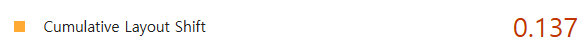
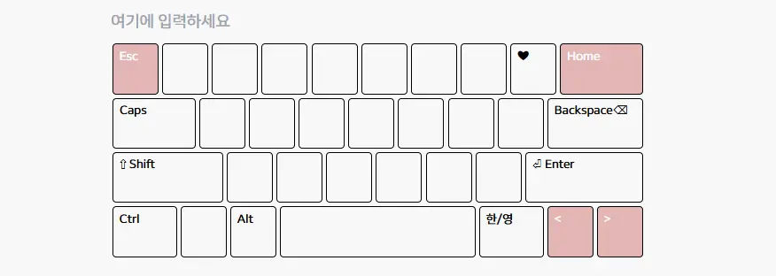
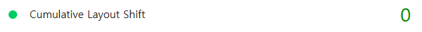

## 누적 레이아웃 이동(CLS)

**CLS**(`Cumulative Layout Shift`)는 페이지 로딩 중 콘텐츠가 갑자기 이동하여 
사용자의 클릭 실수를 유발하거나 읽기 흐름을 방해하는 정도를 측정하는 지표이다. 

시각적 안정성을 나타내며, 보통 **0.1 이하**를 양호한 기준으로 본다고 한다.


### 주요 발생 원인
* **크기가 지정되지 않은 이미지/비디오**: 로드 후 공간을 차지하며 주변 요소를 밀어냄
* **동적으로 삽입된 콘텐츠**: 사용자 상호작용 없이 상단에 갑자기 나타나는 배너나 알림창
* **웹 글꼴(Web Fonts)**: 폰트 로딩 전후의 크기 차이로 인한 텍스트 밀림
* **크기가 없는 광고 및 iframe**: 동적으로 삽입되는 슬롯의 높이가 0일 때 발생

### 핵심 해결 방안
* **공간 선점**: `aspect-ratio`나 `min-height`를 활용해 리소스가 로드되기 전 공간을 미리 확보
* **합성 애니메이션 사용**: 레이아웃 재계산을 피하기 위해 `top`, `left` 대신 `transform`을 사용
* **스켈레톤 UI**: 데이터 로딩 중 실제 콘텐츠와 동일한 크기의 공간을 제공

## 나의 해결 과정 : CLS 0.137 → 0

나의 프로젝트 [TYLE](https://tyletype.vercel.app)은 실시간 타자 연습 서비스로, 시각적 안정성이 매우 중요하다. 

하지만 초기 측정 결과, **0.137**이라는 다소 불안정한 수치가 측정되었다.



단순히 점수만의 문제가 아니라, 페이지를 새로고침할 때마다 하단 키보드 영역이 약 0.5초 정도 늦게 렌더링되면서, 

위에 있던 문장과 입력창이 아래로 툭 떨어지는 `Layout Shift` 현상이 확인되었다.

로딩 중의 레이아웃 이동 문제였지만, 보기에 불편했고 완성도가 떨어져 보였다.

이 문제를 해결하기 위해 **브라우저의 렌더링** 과정과 **하이드레이션**을 다시 들여다보기로 했다.

### 문제: 하이드레이션과 복잡한 키보드 컴포넌트


화면에서 키보드를 로드할때, 레이아웃이 밀리는 현상이 발생했다. 

**커스텀 키보드 컴포넌트**가 다양하고 많은 키캡이 포함된 형태기 때문이었다. 

* **동적 스타일 연산**: 각 키의 너비(`widthClass`)와 색상(`colorClass`)이 런타임에 결정되는 구조
* **자원 경합**: 한글 자모음 분리 로직과 사운드 리소스 로드가 겹쳐, 초기 렌더링 우선순위에서 밀려남

수많은 `DOM` 요소가 동적으로 생성되는 구조에서 데이터 로딩과 하이드레이션 시점이 어긋났고 브라우저가 키보드의 정확한 높이를 알지못해 `UI`가 깨지게 되었다. 이것이 `CLS` 점수의 원인이었다.

```tsx
// 키보드 컴포넌트
export default function KeyboardClient({ keys, onToggleSidebar }: KeyboardProps) {
  return (
    <div className="w-full">
      {keys.map((row, rowIndex) => (
        <div key={rowIndex} className="flex w-full">
          {row.map(({ code, label, color, widthLevel, href }) => {
            // 가로 너비
            const widthClass = 
              widthLevel === 3 ? "w-[120px] flex-grow-0" :
              widthLevel === 2 ? "w-[90px] flex-grow-0" :
              widthLevel === 1 ? "w-[70px] flex-grow-0" :
              widthLevel === 0 ? "flex-grow" : "w-[50px] flex-grow-0";

            // 배경색,테두리
            const colorClass = 
              color === 'blue' ? "bg-[--key-fill-blue] text-white" :
              color === 'red' ? "bg-[--key-fill-red] text-white" :
              "bg-[--key-fill-default] text-black";

            // 공통
            const commonClasses = `
              h-[55px] ...
              ${color === 'blue' ? 'hover:...' : 'hover:...'}
              [&.pressed]:...
              [&.pressed]:...
              ${color === 'blue' ? '[&.pressed]:...' : '[&.pressed]:...'}
              ${widthClass} ${colorClass}
            `;
            ...

            return (
              <div key={code} className={commonClasses}>
                {label}
              </div>
            );
          })}
        </div>
      ))}
    </div>
  );
}
```


### 해결: '선 점유, 후 렌더링' 전략
콘텐츠가 로드된 후 레이아웃이 침범하는 것이 아니라, 이미 확보된 제자리에 스며들도록 구조를 개편했습니다.

* **`Skeleton UI`**: 실제 컴포넌트의 레이아웃과 동일한 크기를 가진 스켈레톤을 설계했다.

* **`Suspense`** : 데이터 로드 중에도 스켈레톤이 영역을 견고하게 방어하도록 구현했다.

```tsx
// 실제 키보드 컴포넌트 높이 선점
const KeyboardSkeleton = () => {
  return (
    <div className="w-full h-[236px] rounded-[8px] border border-black bg-gray-50/50 animate-pulse relative overflow-hidden">
    </div>
  );
};

// 선언적 로딩 처리
<Suspense fallback={<KeyboardSkeleton />}>
    <Keyboard keys={keys} />
</Suspense>
```


이를 통해 컴포넌트가 하이드레이션되기 전후의 높이 차이를 0으로 만들어 브라우저의 레이아웃 재계산을 원천 차단했다.


결과적으로 Lighthouse 측정 기준 **CLS 0**을 달성했다!

