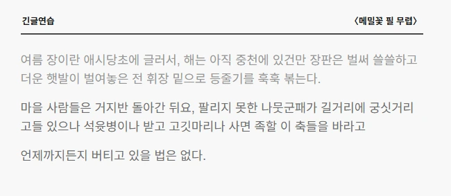

## 들어가며

지금 개발중인 타자 연습 서비스 [TYLE](https://github.com/eeheueklf/typinggame)에는 여느 타자 연습과 마찬가지로 한 줄 씩 치는 **긴 글 연습** 기능이 있다.

기능을 구현하면서 서버에서 애국가 같은 한 줄이 짧은 시/가사 형태의 글도 들어오고

메밀꽃 필 무렵 같은 소설도 불러온다.

```
동해물과 백두산이 마르고 닳도록\n하느님이 보우하사 우리나라 만세\n무궁화 삼천리 화려 강산\n대한 사람 대한으로 길이 보전하세

여름 장이란 애시당초에 글러서, 해는 아직 중천에 있건만 장판은 벌써 쓸쓸하고 더운 햇발이 벌여놓은 전 휘장 밑으로 등줄기를 훅훅 볶는다.마을 사람들은 거지반 돌아간 뒤요, 팔리지 못한 나뭇군패가 길거리에 궁싯거리고들 있으나 석윳병이나 받고 고깃마리나 사면 족할 이 축들을 바라고 언제까지든지 버티고 있을 법은 없다. 춥춥스럽게 날아드는 파리떼도 장난군 각다귀들도 귀치않다.얽둑배기요 왼손잡이인 드팀전의 허생원은 기어코 동업의 조선달에게 낚아보았다.
```

초기에는 줄바꿈(\\n)으로 `split` 하여 문장을 잘라냈지만

소설같은 경우는 줄바꿈 없이 문장이 길게 이어지기 때문에 다시 `width`에 맞게 최대 길이를 설정하고 분리했다.

하지만 단순하게 길이로 문장을 나눌 시 문맥이 깨지거나 줄 끝에 공백이 생기고

사용자가 문장의 끝을 파악하기 어려워 2차적인 문제가 생겼다.

```
여름 장이란 애시당초에 글러서, 해는 아직 중천에 있건만 장판은 벌써 쓸쓸하고 더운 햇발이 벌여놓은 전 휘장 밑으로 등줄기를 훅훅 볶는다.마을 

사람들은 거지반 돌아간 뒤요, 팔리지 못한 나뭇군패가 길거리에 궁싯거리고들 있으나 석윳병이나 받고 고깃마리나 사면 족할 이 축들을 바라고 언제까

지든지 버티고 있을 법은 없다. 춥춥스럽게 날아드는 파리떼도 장난군 각다귀들도 귀치않다.얽둑배기요 왼손잡이인 드팀전의 허생원은 기어코 동업의 
조선달에게 낚아보았다.
```

---

## Lookbehind

단순히 `split(”.”)`를 하면 마침표가 사라져버리지만

[Positive Lookbehind](https://ko.javascript.info/regexp-lookahead-lookbehind)를 활용하면 마침표나 물음표 같은 종결 기호를 유지하면서 잘라낼 수 있다.

한국 수필/소설은 대부분 `-다.`, `?"` ,`."`로 문장이 끝나는 점을 고려하여 문장 단위 `split`을 구현하였다.

분리 기준 :

*   `\n`
*   `(?<=다\.)`
*   `(?<=\.\")`
*   `(?<=\?\")`

추가 고려 사항

*   `split` 하였을때 발생하는 공백을 `trim()`으로 제거
*   길이가 0인 줄은 제거
*   maxLength보다 긴 문장은 반복문으로 잘라서 배열에 추가

```typescript
export const splitByLength = (text: string, maxLength: number): string[] => {
  // 1. 문장 종결 어미를 기준으로 분리
  const lines = text
    .split(/\n|(?<=다\.)|(?<=\.\")|(?<=\?\")/g)
    .map(line => line.trim()) // 불필요한 공백 제거
    .filter(line => line.length > 0);

  const result: string[] = [];

  lines.forEach(line => {
    if (line.length <= maxLength) {
      result.push(line);
    } else {
      // 2. 문장이 너무 길 경우에만 maxLength 단위로 2차 절삭
      for (let i = 0; i < line.length; i += maxLength) {
        result.push(line.slice(i, i + maxLength).trim());
      }
    }
  });

  return result;
};
```

## 결과


```
여름 장이란 애시당초에 글러서, 해는 아직 중천에 있건만 장판은 벌써 쓸쓸하고 더운 햇발이 벌여놓은 전 휘장 밑으로 등줄기를 훅훅 볶는다.

마을 사람들은 거지반 돌아간 뒤요, 팔리지 못한 나뭇군패가 길거리에 궁싯거리고들 있으나 석윳병이나 받고 고깃마리나 사면 족할 이 축들을 바라고

언제까지든지 버티고 있을 법은 없다.
```




## 알게된 점

`(?<=...)` 형태의 정규식 `lookbehind`는 앞에 특정 패턴이 있을 때의 위치를 찾는다.

`lookbehind`는 구형 브라우저에서는 지원되지 않다고 하니, 필요시 `split`으로 대체할 수 있다.  
(최신 Chrome, Edge 등에서는 정상 동작 확인)

정규식 이 녀석이 참 안 들어오는데, `replaceAll`없이도 `replace + /g`를 활용하면 문자열 전체에 적용이 된다는 사실!

---

:::warning

*   관련 문법  
    `split('')` 💜 문자열을 배열로  
    `replace(pattern, replacement)` 🔄 문자열에서 첫번째 특정 패턴 치환  
    `const result: string[] = []` **TypeScript 문법** 배열에 들어갈 수 있는 타입을 string으로 고정  
    `.trim()` 문자열 양 끝의 공백 제거
*   정규식  
    `/(?<=다\.)/g` lookbehind, 앞에 특정 패턴이 있는 위치를 탐색  
    `/\s+$/g` 문자열 끝의 모든 공백 제거  
    :::