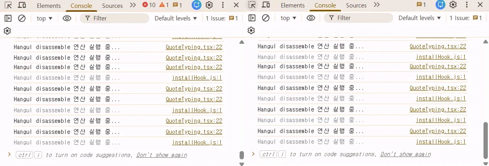

## 들어가며


타자 연습 서비스 [TYLE](https://tyletype.vercel.app)에는 사용자가 **타자 치는 맛**이 나도록 도입했던 세가지 핵심 기능이 있다.


1. **타이핑 진척도**를 색상과 실시간 `CPM`으로 표현


2. **키보드 인터렉션**: 현재 누르고 있는 키를 실시간으로 표시


3. 타자기 **소리** 인터렉션 📣


하지만 기능이 추가되고 난 뒤, 텍스트가 길어질 때 입력 지연이 발생했다. 

사용자가 키를 누를 때마다 **연산-렌더링-사운드재생**이 동시에 일어나며 브라우저에 과부하가 걸린 것이다. 

다음은 이를 해결하기 위해 진행한 세 가지 최적화 과정이다. 

## useMemo로 연산 비용 절감

한글은 자음과 모음이 합쳐지는 조합형 문자이기 때문에 정확한 타수 계산을 위해 `Hangul.disassemble` 과정이 필수적이다.
하지만 자모음을 분리하는 `Hangul.disassemble`로직은 텍스트가 길어질수록 무거워진다.

```tsx {3}
export const calculateTotalChars = (text: string): number => {
  <!-- 맑음  -> 'ㅁ,ㅏ,ㄹ,ㄱ,ㅇ,ㅡ,ㅁ' ->  7타 -->
  return Hangul.disassemble(text, true).flat().length;
};
```

`CPM`(분당타수)를 실시간으로 표시하기 위해 0.1초마다 타이머 상태가 업데이트 되고 있었는데

이때마다 `calculateTotalChars`가 호출되어 무의미한 연산이 반복되고 있었다.

따라서 `useMemo`를 도입하여 **입력값이 변할 때만** 연산을 수행하도록 **메모이제이션**했다.

```tsx
const totalTypedChars = useMemo(() => calculateTotalChars(inputValue), [inputValue]);
```
이를 통해 타이머에 의한 리렌더링이 발생해도,  
사용자가 타이핑하지 않는다면 캐싱된 값을 재사용하여 연산 수행 횟수를 대폭 낮췄다.


*연산 호출 전 후*  


## 렌더링 성능 개선

실시간 `CPM`은 입력이 없어도 시간이 흐름에 따라 계속 변해야 한다. 

이를 구현하기 위해 100ms 단위로 상태를 업데이트 하는 [`setInterval`](https://developer.mozilla.org/ko/docs/Web/API/Window/setInterval)을 사용했다.

하지만 `setInterval`은 컴포넌트가 사라져도 백그라운드에서 계속 돌아가는 **메모리 누수**가 발생할 수 있기 때문에

`useEffect`의 [`cleanup`](https://react.dev/reference/react/useEffect#my-cleanup-logic-runs-even-though-my-component-didnt-unmount)함수를 활용해
컴포넌트가 사라지거나 타이핑이 끝났을 때 타이머를 확실히 꺼주었다.

```TypeScript {8}
useEffect(() => {
  if (startTime === null || completed) return;

  const interval = setInterval(() => {
    setCpm(calculateCpm(totalTypedChars, startTime));
  }, 100);

  return () => clearInterval(interval);
}, [startTime, totalTypedChars, completed]);
```


## 실시간 타자 소리 구현
마지막으로 타이핑 소리 문제를 해결했다.  
처음에는 기본 `audio` 태그를 사용하여 구현했지만, 빠른 타이핑 속도를 따라오지 못하고 소리가 밀리는 현상이 생겼다. 

그래서 선택한 것이 **비동기 오디오 처리**를 위한 [`Web Audio API`](https://developer.mozilla.org/ko/docs/Web/API/Web_Audio_API)이다.  
사운드 데이터를 메모리에 미리 로드하고 비동기로 재생하여 렌더링 성능을 확보했다.

결과적으로 소리 지연이 거의 없고, 쾌적한 타자 소리를 재생할 수 있었다!


## 알게된 점


이번 리팩토링을 통해 알게된 점은 **UI의 완성도는 탄탄한 최적화에서 결정된다**는 것이다!!

애니메이션과 사운드로 즐거움을 줄 순 있지만, 안정적인 성능을 고려하지 않는다면 불쾌한 지연으로 돌아올 수 있다는것..

또한 기능 구현을 목적으로 코드를 작성할때도 메모리 누수를 파악하고 예방하는 단계를 가져야겠다.


