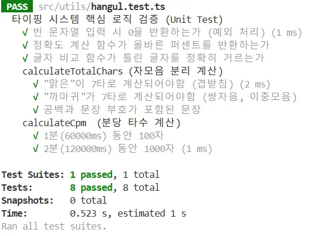

## 들어가며


내가 타자 연습 사이트를 만들면서 가장 중요하게 고려한 것은 **타자 속도의 정확한 측정**이다. 

한글은 초성, 중성, 종성의 조합으로 이루어져 있기 때문에 문자열 길이로만 타수를 측정할 수 없다.  
이를 위해 문자 **분리 과정, 타수 계산, 정확도 측정** 등 연산이 필요한 상황에서 [`Jest`](https://jestjs.io/)를 도입하여 로직을 테스트해보는 유닛 테스트를 설계해보았다.


### 연산 로직의 독립과 모듈화

UI 구성 요소 내에 계산 로직이 섞여 있으면 테스트가 어렵고 유지보수가 까다롭다. 이를 해결하기 위해 `Hangul.js` 등을 활용한 한글 분리 로직과 `CPM` 연산 로직을 별도의 `typingUtils.ts` 모듈로 분리했다. 테스팅의 정확도를 올리고 함수만 쉽게 테스트할 수 있도록 환경을 만든 것이다.


## 글자수, 타수 연산 검증
한글은 **맑은**과 같은 겹받침, **까마귀**와 같은 쌍자음 및 이중모음에 따라 타수 계산 방식이 달라진다. 
`calculateTotalChars` 함수는 이러한 한글의 특성을 반영하여 실제 타건 횟수를 계산한다.

```typescript
describe('calculateTotalChars (자모음 분리 계산)', () => {
  test('"맑은"이 7타로 계산되어야함 (겹받침)' , () => {
    const result = calculateTotalChars("맑은");
    expect(result).toBe(7); // ㅁ+ㅏ+ㄹ+ㄱ+ㅇ+ㅡ+ㄴ = 7
  });

  test('"까마귀"가 7타로 계산되어야함 (쌍자음, 이중모음)' , () => {
    const result = calculateTotalChars("까마귀");
    expect(result).toBe(7); // ㄲ+ㅏ+ㅁ+ㅏ+ㄱ+ㅜ+ㅣ = 7
  });

  test('공백과 문장 부호가 포함된 문장', () => {
    const result = calculateTotalChars("안녕! 하세요");
    expect(result).toBe(14);
  });
});
```
여러 가지 상황에서의 검증을 통해 다양한 입력 상황에서 연산의 정확성을 확인 할 수 있었다.

## 글자 비교 로직의 정교화
타이핑의 정확도를 판별하는, 사용자가 **입력한 텍스트와 원문 텍스트를 비교**하는 로직도 유닛 테스트의 대상이다.
`calculateCorrectCount`는 사용자가 입력한 텍스트와 원문 텍스트를 반복문을 통해 비교한다.

```typescript
test('글자 비교 함수가 틀린 글자를 정확히 거르는가', () => {
  expect(calculateCorrectCount("사과", "사람")).toBe(1);
  expect(calculateCorrectCount("맑음", "맊음")).toBe(1);
});
```
함수를 통해 계산된 데이터는 `calculateAccuracy` 함수로 전달되어 최종 정확도를 계산한다.


## CPM 연산과 런타임 에러 방지
`CPM`과 정확도 계산은 사용자에게 실시간으로 피드백을 주는 핵심 지표다. 이 과정에서 발생할 수 있는 *0 나누기* `Division by Zero` 오류나 예상치 못한 입력값에 대한 예외 처리를 확인했다.

```typescript
describe('calculateCpm (분당 타수 계산)', () => {
  test('1분(60000ms) 동안 100자', () => {
    const startTime = Date.now() - 60000;
    const result = calculateCpm(100, startTime);
    expect(result).toBe(100);
  });
});

test('정확도 계산 함수가 올바른 퍼센트를 반환하는가', () => {
  expect(calculateAccuracy(80, 100)).toBe(80);
  expect(calculateAccuracy(0, 0)).toBe(0); // 0 나누기 방지 검증
});
```
입력 초기 단계에서 발생할 수 있는, **오류를 방어할 수 있는 로직**이 잘 구현되었는지 테스트를 통해 확인하고 명세화했다.


## 마무리


타자 연습 서비스에서 가장 중요하게 여긴 연산 로직을 유닛 테스트로 꼼꼼히 검증했다.

테스트 케이스를 설계하고, 모든 케이스를 통과하는 것을 눈으로 직접 확인해보니, 이전에 들었던 오류에 대한 불안감이 내 코드에 대한 믿음으로 바뀌었다..!

테스팅은 리팩토링을 진행하거나, 회사에서 검증된 결과물을 증명해야 할 때 반드시 필요한 **코드의 명세서**같다. 테스팅을 성장을 위한 필수적인 습관으로 단단히 들여놓아야겠다.